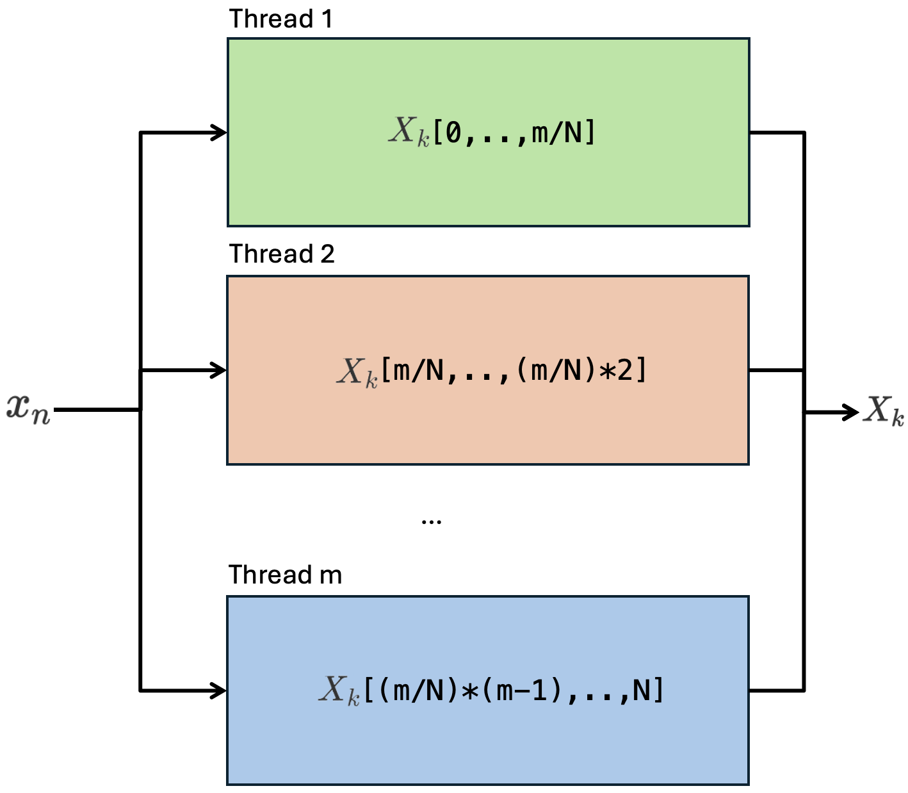

```
    describe always the compute capability of the resource you are using;
    use ICC/ICX on our workstations, GCC with Colab;
    use the BEST sequential execution time;
    always provide the compilation and execution commands (e.g. icc -O3 -xHost...);
    consider different and meaningful data sizes (i.e. no sequential execution time shorter than a few seconds).   
```

# HPC - OpenMP report 🏎️ 💻
## Leonardo Gonfiantini, Christian Parodi, Enrico Pezzano
### December 2024

# Introduction 🎬
The goal of this laboratory is to optimize the implementation of the Discrete Fourier Transform (DFT) algorithm by leveraging OpenMP HPC techniques, with a focus on parallelization and vectorization, especially on the hotspots. We aim to reduce execution time without compromising computational accuracy, keeping the tracked error rate as low as possible. Key challenges such as identifying hotspots, addressing potential vectorization barriers, parallelization problems, and managing thread scalability are discussed in depth.

# Hardware Capability ⚙️
For this first assignment, we executed the c code using the Software 2 (SW2), with the following characteristics.
++++neofetch screen :)

# Algorithm analysis 👨🏻‍💻
The Fourier Transform is a mathematical transformation used to convert a function of time (or space) into a function of frequency. It is defined as:

$$
\mathcal{F}\{f(t)\} = F(\omega) = \int_{-\infty}^{\infty} f(t) e^{-i \omega t} \, dt
$$

For discrete signals, the Discrete Fourier Transform (DFT) is used, which is defined as:

$$
X_k = \sum_{n=0}^{N-1} x_n \cdot e^{-i \frac{2\pi}{N} k n} = \sum_{n=0}^{N-1} x_n \cdot \left( \cos\left(\frac{2\pi}{N} k n\right) + i \sin\left(\frac{2\pi}{N} k n\right) \right)
$$

where:
- \( X_k \) is the DFT of the sequence \( x_n \)
- \( N \) is the number of points in the sequence
- \( k \) is the index of the output frequency component
- \( n \) is the index of the input time-domain sequence
- \( i \) is the imaginary unit

The inverse DFT (IDFT) is given by:

$$
x_n = \frac{1}{N} \sum_{k=0}^{N-1} X_k \cdot e^{i \frac{2\pi}{N} k n} =\frac{1}{N} \sum_{k=0}^{N-1} X_k \cdot \left( \cos\left(\frac{2\pi}{N} k n\right) + i \sin\left(\frac{2\pi}{N} k n\right) \right)
$$

Notice it is just the DFT of the DFT.

# Parallelization strategy 🧠
Since it is a sum of $N$ elements, it can be splitted into $m$ different threads, each with $N/m$ sums to compute.

<div style="display: flex; align-items: center; width: 100%;">
  <figure style="display: flex; flex-direction: column; justify-content: center; align-items: center;">
    
  </figure>
</div>

# Hotspot analysis 🔥
The only hotspot that is worth mentioning is the `loop in DFT at omp_homework.c:71`, as it takes $\approx 98\%$ of the computation time. The said loop is the following:

```c
for (k = 0; k < N; k++) {
   for (n = 0; n < N; n++) {
   // Real part of X[k]
   Xr_o[k] += xr[n] * cos(n * k * PI2 / N) + idft * xi[n] * sin(n * k * PI2 / N);
   // Imaginary part of X[k]
   Xi_o[k] += -idft * xr[n] * sin(n * k * PI2 / N) + xi[n] * cos(n * k * PI2 / N);
   }
}
```

Since it is in $O(N^2)$, massaging this section is crucial to speed up the program.

OLD {
inside the vanilla version of the code, the hotspot is on the line 70 (the nested outer for loop takes 13.2 seconds out of the 13.44 seconds of total execution time)
inside the vanilla version of the code, the hotspot is on the line 71 (the nested inner for loop takes 13.2 seconds out of the 13.44 seconds of total execution time)
it is a scalar loop that can be parallelized with OpenMP
}

# Compiler settings 🔧
We compiled the program using the following command:

```bash
icx -g -Wall -std=c99 -qopenmp -qopt-report=3 -xHost -O3 -ffast-math omp_homework.c
```
In this way, the code is properly optimized, the best istruction set is used and the program is vectorized when possible.

In particular:
- the **-g** flag enables the debug;
- the **-Wall** flag enables compilation errors;
- the **-std=c99** flag enables standard ISO C99;
- the **-qopenmp** flag enables OpenMP;
- the **-qopt-report=3** flag produce detailed information about the optimizations performed by the compiler;
- the **-xHost** flag optimize the compilation process relative to the host CPU and architecture;
- the **-O3** flag optimize the compilation process at high level;
- the **-ffast-math** flag: 
   - reordering of operations (i.e. `(a + b) + c = a + (b + c)` )
   - use of approximations
   - disabling special number handling
   - ignoring associative and distributive rules (i.e. `x / y / z` might be computed as `x / (y * z)` for better efficiency).

# Vectorization 🏹
First of all, we studied the code alone and we interrogated ourselves about possible vectorization problems that seemed to not be there. 
Secondly, we leveraged the OpenMP report flag in order to produce useful outputs about what the compiler did. The following texts display what we obtained as said report.
```
hihihihhi
```
After a deep analysis, we concluded that the possible vectorization optimizations are negligible. 
Indeed, in the context of this laboratory, we did not notice any vectorization issues (i.e. loop carried dependencies, Read after Write).


# Optimizations 🛤️
The first thing we changed was the `sin` and `cos` computation. Those are used in both the statements inside the inner loop, so they can be extracted to variables. Even though it is not a parallelization problem per se, caching in this way the computation of the trigonometric functions, further improve the performance.

```c
double cos_res = cos(n * k * PI2 / N);
double sin_res = sin(n * k * PI2 / N);

// Real part of X[k]
Xr_o[k] += xr[n] * cos_res + idft * xi[n] * sin_res;
// Imaginary part of X[k]
Xi_o[k] += -idft * xr[n] * sin_res + xi[n] * cos_res;
```

Then, there is the actual parallelization part. We used OpenMP as follows:

```c
double cos_res;
double sin_res;

#pragma omp parallel for num_threads(NTHREADS) \
private(cos_res, sin_res) collapse(2) schedule(static) reduction(+ : Xr_o[ : N], Xi_o[ : N])
for (k = 0; k < N; k++) {
   for (n = 0; n < N; n++) {
      cos_res = cos(n * k * PI2 / N);
      sin_res = sin(n * k * PI2 / N);

      // Real part of X[k]
      Xr_o[k] += xr[n] * cos_res + idft * xi[n] * sin_res;
      // Imaginary part of X[k]
      Xi_o[k] += -idft * xr[n] * sin_res + xi[n] * cos_res;
   }
}
```

In order, we declared `cos_res` and `sin_res` outside the parallel region, because since they depend on `k` and `n`, they have to be private for each thread. Then, we collapsed the nested loops in a single $N \times N$ loop managed by OMP, then with the `schedule(static)` we stated that every thread would have had the same chunk size to work on, and finally the `reduction` clause aggregates the sums on the arrays.


# Performance evaluation 🤔


TODO sunday :)

using vectorization as in the code inside omp homework, the execution time is 0.71 seconds, which is 18.5 times faster than the vanilla version of the code (for N=10000) with a non existent error (Xre = 10000.0000)


+ tables and graphs

# Conclusions 🔚
TODO :)
In conclusion, by leveraging vectorization and multithreading. Other than that, we also noticed how small
changes in the code could lead to significant change in performance.