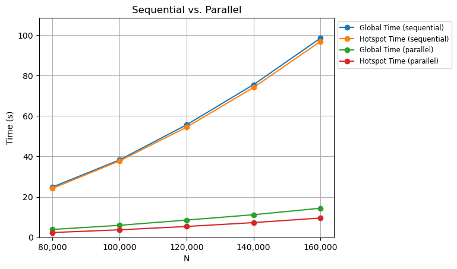
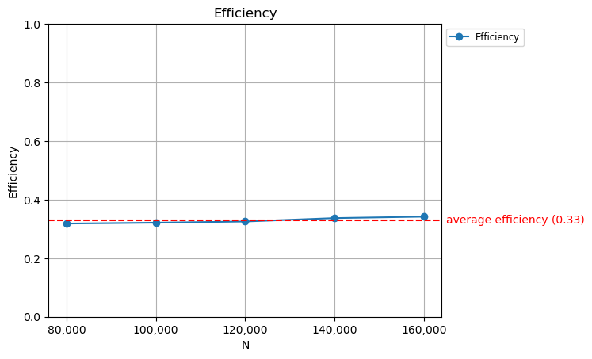

# HPC - OpenMP report 🏎️ 💻
**Leonardo Gonfiantini, Christian Parodi, Enrico Pezzano**

# Introduction 🎬

The goal of this laboratory is to optimize the implementation of the Discrete Fourier Transform (DFT) algorithm by leveraging OpenMP HPC techniques, with a focus on parallelization and vectorization, especially on the hotspots. We aim to reduce execution time without compromising computational accuracy, keeping the tracked error rate as low as possible. Key challenges such as identifying hotspots, addressing potential vectorization barriers, parallelization problems, and managing thread scalability are discussed in depth.

# Hardware Capability ⚙️

For this first assignment, we executed the C code using the Software 2 (SW2) workstations, with the following characteristics.

```
S4825087@sw209:~$ lscpu
Architecture:                    x86_64
CPU op-mode(s):                  32-bit, 64-bit
Byte Order:                      Little Endian
Address sizes:                   46 bits physical, 48 bits virtual
CPU(s):                          20
On-line CPU(s) list:             0-19
Thread(s) per core:              1
Core(s) per socket:              12
Socket(s):                       1
NUMA node(s):                    1
Vendor ID:                       GenuineIntel
CPU family:                      6
Model:                           151
Model name:                      12th Gen Intel(R) Core(TM) i7-12700
Stepping:                        2
CPU MHz:                         2100.000
CPU max MHz:                     3876.9570
CPU min MHz:                     800.0000
BogoMIPS:                        4224.00
Virtualization:                  VT-x
L1d cache:                       288 KiB
L1i cache:                       192 KiB
L2 cache:                        7.5 MiB
NUMA node0 CPU(s):               0-19
Vulnerability Itlb multihit:     Not affected
Vulnerability L1tf:              Not affected
Vulnerability Mds:               Not affected
Vulnerability Meltdown:          Not affected
Vulnerability Mmio stale data:   Not affected
Vulnerability Retbleed:          Not affected
Vulnerability Spec store bypass: Mitigation; Speculative Store Bypass disabled via prctl
Vulnerability Spectre v1:        Mitigation; usercopy/swapgs barriers and __user pointer sanitization
Vulnerability Spectre v2:        Mitigation; Enhanced IBRS, IBPB conditional, RSB filling, PBRSB-eIBRS S
                                 W sequence
Vulnerability Srbds:             Not affected
Vulnerability Tsx async abort:   Not affected
Flags:                           fpu vme de pse tsc msr pae mce cx8 apic sep mtrr pge mca cmov pat pse36
                                  clflush dts acpi mmx fxsr sse sse2 ss ht tm pbe syscall nx pdpe1gb rdt
                                 scp lm constant_tsc art arch_perfmon pebs bts rep_good nopl xtopology n
                                 onstop_tsc cpuid aperfmperf tsc_known_freq pni pclmulqdq dtes64 monitor
                                  ds_cpl vmx smx est tm2 ssse3 sdbg fma cx16 xtpr pdcm pcid sse4_1 sse4_
                                 2 x2apic movbe popcnt tsc_deadline_timer aes xsave avx f16c rdrand lahf
                                 _lm abm 3dnowprefetch cpuid_fault epb invpcid_single ssbd ibrs ibpb sti
                                 bp ibrs_enhanced tpr_shadow vnmi flexpriority ept vpid ept_ad fsgsbase 
                                 tsc_adjust bmi1 avx2 smep bmi2 erms invpcid rdseed adx smap clflushopt 
                                 clwb intel_pt sha_ni xsaveopt xsavec xgetbv1 xsaves split_lock_detect a
                                 vx_vnni dtherm ida arat pln pts hwp hwp_notify hwp_act_window hwp_epp h
                                 wp_pkg_req hfi umip pku ospke waitpkg gfni vaes vpclmulqdq tme rdpid mo
                                 vdiri movdir64b fsrm md_clear serialize pconfig arch_lbr ibt flush_l1d 
                                 arch_capabilities
```


# Algorithm analysis 👨🏻‍💻

The Fourier Transform is a mathematical transformation used to convert a function of time (or space) into a function of frequency. It is defined as:

$$
\mathcal{F}\{f(t)\} = F(\omega) = \int_{-\infty}^{\infty} f(t) e^{-i \omega t} \, dt
$$

For discrete signals, the Discrete Fourier Transform (DFT) is used, which is defined as:

$$
X_k = \sum_{n=0}^{N-1} x_n \cdot e^{-i \frac{2\pi}{N} k n} = \sum_{n=0}^{N-1} x_n \cdot \left( \cos\left(\frac{2\pi}{N} k n\right) + i \sin\left(\frac{2\pi}{N} k n\right) \right)
$$

where:
- \( X_k \) is the DFT of the sequence \( x_n \)
- \( N \) is the number of points in the sequence
- \( k \) is the index of the output frequency component
- \( n \) is the index of the input time-domain sequence
- \( i \) is the imaginary unit

The inverse DFT (IDFT) is given by:

$$
x_n = \frac{1}{N} \sum_{k=0}^{N-1} X_k \cdot e^{i \frac{2\pi}{N} k n} =\frac{1}{N} \sum_{k=0}^{N-1} X_k \cdot \left( \cos\left(\frac{2\pi}{N} k n\right) + i \sin\left(\frac{2\pi}{N} k n\right) \right)
$$

Notice it is just the DFT of the DFT.

# Parallelization strategy 🧠

Since it is a sum of $N$ elements, it can be split into $m$ different threads, each with $N/m$ sums to compute.

<div style="display: flex; align-items: center; width: 100%;">
  <figure style="display: flex; flex-direction: column; justify-content: center; align-items: center;">
    
  </figure>
</div>

# Hotspot analysis 🔥
The only hotspot that is worth mentioning is the `loop in DFT at omp_homework.c:71`, as it takes $\approx 98\%$ of the computation time. The said loop is the following:

```c
for (k = 0; k < N; k++) {
    for (n = 0; n < N; n++) {
        // Real part of X[k]
        Xr_o[k] += xr[n] * cos(n * k * PI2 / N) + idft * xi[n] * sin(n * k * PI2 / N);
        // Imaginary part of X[k]
        Xi_o[k] += -idft * xr[n] * sin(n * k * PI2 / N) + xi[n] * cos(n * k * PI2 / N);
    }
}
```

Since it is in $O(N^2)$, massaging this section is crucial to speed up the program, in this context, using OpenMP.

# Compiler settings 🔧

We compiled the program using the following command:

```bash
icx -g -Wall -qopenmp -qopt-report=3 -xHost -O3 -ffast-math omp_homework.c
```

In this way, the code is properly optimized, the best istruction set is used and the program is vectorized when possible.

In particular:
- the **-g** flag enables the debug;
- the **-Wall** flag enables compilation warnings;
- the **-qopenmp** flag enables OpenMP;
- the **-qopt-report=3** flag produces detailed information about the optimizations performed by the compiler;
- the **-xHost** flag optimizes the compilation process relative to the host CPU and architecture (using the best registries);
- the **-O3** flag optimizes the compilation process at high level;
- the **-ffast-math** flag performs: 
   - reordering of operations (i.e. `(a + b) + c = a + (b + c)` )
   - use of approximations
   - disabling special number handling
   - ignoring associative and distributive rules (i.e. `x / y / z` might be computed as `x / (y * z)` for better efficiency).

# Vectorization 🏹

First of all, we studied the code alone and we interrogated ourselves about possible vectorization problems that seemed not to be there. 
Secondly, we leveraged the OpenMP report flag in order to produce useful outputs about what the compiler did. The following texts display what we obtained as said report, only for the hotspot, for readability issues.

```
Begin optimization report for: DFT

LOOP BEGIN at ./source/omp_homework.c (83, 3)
<Multiversioned v2>
    remark #25452: Poor spatial locality detected in memref(s). 
    remark #15319: Loop was not vectorized: novector directive used

    LOOP BEGIN at ./source/omp_homework.c (84, 5)
        remark #15319: Loop was not vectorized: novector directive used
    LOOP END
LOOP END

LOOP BEGIN at ./source/omp_homework.c (83, 3)
<Multiversioned v1>
    remark #25228: Loop multiversioned for Data Dependence
    remark #25452: Poor spatial locality detected in memref(s). 
    remark #15541: loop was not vectorized: outer loop is not an auto-vectorization candidate.

    LOOP BEGIN at ./source/omp_homework.c (84, 5)
        remark #25528: Load/Store of reduction at line 91 sinked after loop
        remark #25563: Load hoisted out of the loop
        remark #25564: Store sinked out of the loop
        remark #25583: Number of Array Refs Scalar Replaced In Loop: 2
        remark #15300: LOOP WAS VECTORIZED
        remark #15305: vectorization support: vector length 4
        remark #15389: vectorization support: unmasked unaligned unit stride load: xr [ /home/chris/high-performance-clowns/hw1/./source/omp_homework.c (89, 18) ] 
        remark #15389: vectorization support: unmasked unaligned unit stride load: xi [ /home/chris/high-performance-clowns/hw1/./source/omp_homework.c (89, 43) ] 
        remark #15475: --- begin vector loop cost summary ---
        remark #15476: scalar cost: 101.000000 
        remark #15477: vector cost: 27.593750 
        remark #15478: estimated potential speedup: 3.625000 
        remark #15309: vectorization support: normalized vectorization overhead 0.359375
        remark #15482: vectorized math library calls: 2 
        remark #15488: --- end vector loop cost summary ---
        remark #15447: --- begin vector loop memory reference summary ---
        remark #15450: unmasked unaligned unit stride loads: 2 
        remark #15474: --- end vector loop memory reference summary ---
        remark #25587: Loop has reduction
        remark #15590: vectorization support: add reduction with value type double [./source/omp_homework.c:83:3]
        remark #15590: vectorization support: add reduction with value type double [./source/omp_homework.c:83:3]
    LOOP END

    LOOP BEGIN at ./source/omp_homework.c (84, 5)
    <Remainder loop for vectorization>
        remark #15440: remainder loop was vectorized (masked)
        remark #15305: vectorization support: vector length 4
        remark #15389: vectorization support: masked unaligned unit stride load: xr [ /home/chris/high-performance-clowns/hw1/./source/omp_homework.c (89, 18) ] 
        remark #15389: vectorization support: masked unaligned unit stride load: xi [ /home/chris/high-performance-clowns/hw1/./source/omp_homework.c (89, 43) ] 
        remark #15475: --- begin vector loop cost summary ---
        remark #15482: vectorized math library calls: 2 
        remark #15488: --- end vector loop cost summary ---
        remark #15447: --- begin vector loop memory reference summary ---
        remark #15456: masked unaligned unit stride loads: 2 
        remark #15474: --- end vector loop memory reference summary ---
        remark #25261: Single iteration loop optimized away
    LOOP END
LOOP END
```

After a deep analysis, we concluded that the possible vectorization optimizations are negligible. 
Indeed, in the context of this laboratory, we did not notice any vectorization issues (i.e. loop carried dependencies, Read after Write, etc.).

# Optimizations 🛤️

The first thing we changed was the `sin` and `cos` computation. Those are used in both the statements inside the inner loop, so they can be extracted to variables. Even though it is not a parallelization problem per se, caching in this way the computation of the trigonometric functions, further improves the performance.

```c
double cos_res = cos(n * k * PI2 / N);
double sin_res = sin(n * k * PI2 / N);

// Real part of X[k]
Xr_o[k] += xr[n] * cos_res + idft * xi[n] * sin_res;
// Imaginary part of X[k]
Xi_o[k] += -idft * xr[n] * sin_res + xi[n] * cos_res;
```

Then, there is the actual parallelization part. We used OpenMP as follows:

```c
double cos_res;
double sin_res;

#pragma omp parallel for num_threads(NTHREADS) private(cos_res, sin_res)
for (k = 0; k < N; k++) {
   for (n = 0; n < N; n++) {
      cos_res = cos(n * k * PI2 / N);
      sin_res = sin(n * k * PI2 / N);

      // Real part of X[k]
      Xr_o[k] += xr[n] * cos_res + idft * xi[n] * sin_res;
      // Imaginary part of X[k]
      Xi_o[k] += -idft * xr[n] * sin_res + xi[n] * cos_res;
   }
}
```

We declared `cos_res` and `sin_res` outside the parallel region, because since they depend on `n` and `k`, they have to be private for each thread.

# Performance evaluation 🤔

We performed the tests on the workstation in SW2, which has 20 cores with 1 thread per core (so no hyperthreading). so we defined `NTHREADS=20`. The only hotspot in the code was the `loop in main at omp_homework.c:26` already discussed, so each measurements refers to the global time and this hotspot's time.

<div style="display: flex; align-items: center; width: 100%;">
  <figure style="display: flex; flex-direction: row; justify-content: center; align-items: center;">
    
  </figure>
</div>

As we expected, the greater the problem size, the longer it will take to execute. We also highlight how close are the sequential global time and hotspot time (meaning that the hotspot is the responsible of the whole execution). Also, the parallel execution is much faster and the two slopes (parallel hotspot and global time) have a larger gap between them, because of the overhead introduced by multithreading.

### Speedup & Efficiency

<div style="display: flex; align-items: center; width: 100%;">
  <figure style="display: flex; flex-direction: column; justify-content: center; align-items: center;">
    
  </figure>
</div>

<div style="display: flex; align-items: center; width: 100%;">
  <figure style="display: flex; flex-direction: column; justify-content: center; align-items: center;">
    
  </figure>
</div>

As we can state from the plots, we have an average speedup of $6.6$  and an average efficiency of the $33\%$, meaning that our code goes more than 6 times faster in parallel mode than in sequential, but each thread could be used better.

# Conclusions 🔚

In conclusion, by leveraging OpenMP parallelization techniques and optimizing trigonometric computations, we achieved significant performance improvements in the DFT implementation. The parallel execution demonstrated substantial speedup compared to the sequential version, particularly for larger problem sizes. While vectorization opportunities were limited, the combination of compiler optimizations (-O3, -xHost, -ffast-math) and OpenMP parallelization proved effective in reducing execution time while maintaining computational accuracy.