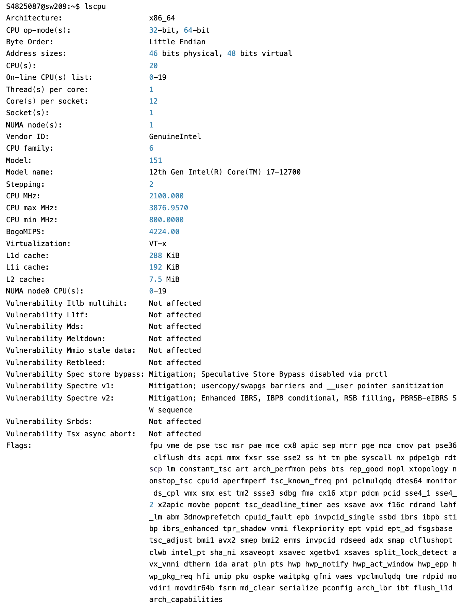

<!-- # prof instruction
--------------------------------------------------------
Write a program that accelerates the attached program that computes the 2D heat conduction formula (see jpg).

Evaluate different configurations <<<block, thread>>> AND different problem sizes.

As for the OMP homework, the focus is on writing an exhaustive report about the code analysis (i.e. hotspot identification) and the iterative process to speed up the application.

You should discuss at least the following points:

- hotspot identification with NUMBERS. Don't say only that the main hotspot is the for loop in lines xx-yy, but that is a hotspot because it requires e.g. 80 seconds for a global time of 100 seconds;
- discuss possible vectorization issues with the report provided by the Intel compiler;
- define the BEST sequential time to be used as reference;
- present the performance using Google colab;
- provide tables and charts regarding speedup values only;
- do not consider data size resulting in sequential execution time < 30 seconds;
- discuss conclusions.
The use of your pc is allowed ONLY if you plan to explore ROCm on a AMD cpu. Otherwise you can develop on your PC but the tests have to be performed with Colab, the sequential ones using gcc .

Upload a zip file containing the notebook, other possible files and the report in pdf. Send the same via email.

The compute capabilities of the GPU in Colab can be retrieved using the devicequery program.
-------------------------------------------------------- -->

# Introduction

In this report, we aim to accelerate a given program that computes the 2D heat conduction 
formula using CUDA. The primary objective is to evaluate different configurations of 
blocks and threads, as well as various problem sizes, to achieve optimal performance. We 
will conduct a thorough analysis of the code to identify hotspots and discuss potential 
vectorization issues. The best sequential time will be established as a reference point, 
and performance metrics will be presented using Google Colab. The report will include 
charts to illustrate speedup values, focusing on data sizes that result in 
sequential execution times of 30 seconds or more. Finally, we will draw conclusions based 
on our findings.

# Hardware Capability ⚙️

## SW2 capabilities

We executed the C code using the Software 2 (SW2) workstations, with the following characteristics:

<div style="display: flex; justify-content: center; align-items: center; width: 100%;">
  <figure style="display: flex; flex-direction: row; justify-content: center; align-items: center;">
    
  </figure>
</div>

We have found those characteristics using the command:

```bash
lscpu
```

## Google Colab hardware capabilities

The VM of google colab is equipped with this GPU:

```bash
+---------------------------------------------------------------------------------------+
| NVIDIA-SMI 535.104.05             Driver Version: 535.104.05   CUDA Version: 12.2     |
|-----------------------------------------+----------------------+----------------------+
| GPU  Name                 Persistence-M | Bus-Id        Disp.A | Volatile Uncorr. ECC |
| Fan  Temp   Perf          Pwr:Usage/Cap |         Memory-Usage | GPU-Util  Compute M. |
|                                         |                      |               MIG M. |
|=========================================+======================+======================|
|   0  Tesla T4                       Off | 00000000:00:04.0 Off |                    0 |
| N/A   36C    P8               9W /  70W |      0MiB / 15360MiB |      0%      Default |
|                                         |                      |                  N/A |
+-----------------------------------------+----------------------+----------------------+
```

We have found those characteristics using the command:

```bash
!nvidia-smi
```

# Hotspot identification

The nested loops in the `step_kernel_mod` function:

```C
void step_kernel_mod(int ni, int nj, float fact, float* temp_in, float* temp_out) {
  int i00, im10, ip10, i0m1, i0p1;
  float d2tdx2, d2tdy2;

  // loop over all points in domain (except boundary)
  for (int j = 1; j < nj - 1; j++) {
    for (int i = 1; i < ni - 1; i++) {
      // find indices into linear memory
      // for central point and neighbours
      i00 = I2D(ni, i, j);
      im10 = I2D(ni, i - 1, j);
      ip10 = I2D(ni, i + 1, j);
      i0m1 = I2D(ni, i, j - 1);
      i0p1 = I2D(ni, i, j + 1);

      // evaluate derivatives
      d2tdx2 = temp_in[im10] - 2 * temp_in[i00] + temp_in[ip10];
      d2tdy2 = temp_in[i0m1] - 2 * temp_in[i00] + temp_in[i0p1];

      // update temperatures
      temp_out[i00] = temp_in[i00] + fact * (d2tdx2 + d2tdy2);
    }
  }
}
```

This section iterates over nearly every grid point (excluding the boundaries) on a large `SIZExSIZE` matrix for each of the 200 time steps. Each iteration involves multiple memory accesses, that means reading the central cell and its four neighbours. This segment accesses adjacent elements and performs several arithmetic operations to compute the finite difference update, making the routine both compute-bound and memory-bound.

# Vectorization

```bash
Begin optimization report for: step_kernel_mod

# MAIN HOTSPOT
LOOP BEGIN at hw2/heat_vanilla.c (18, 3)
<Multiversioned v2>
    remark 15319: Loop was not vectorized: novector directive used

    LOOP BEGIN at hw2/heat_vanilla.c (19, 5)
        remark 15319: Loop was not vectorized: novector directive used
    LOOP END
LOOP END
# END MAIN HOTSPOT

LOOP BEGIN at hw2/heat_vanilla.c (18, 3)
<Multiversioned v1>
    remark 15541: loop was not vectorized: outer loop is not an auto-vectorization candidate.

    LOOP BEGIN at hw2/heat_vanilla.c (19, 5)
        remark 15300: LOOP WAS VECTORIZED
        remark 15305: vectorization support: vector length 4
        remark 15389: vectorization support: unmasked unaligned unit stride load: [ /home/leonardo/Github/high-performance-clowns/hw2/heat_vanilla.c (29, 36) ] 
        remark 15389: vectorization support: unmasked unaligned unit stride load: [ /home/leonardo/Github/high-performance-clowns/hw2/heat_vanilla.c (29, 51) ] 
        remark 15389: vectorization support: unmasked unaligned unit stride load: [ /home/leonardo/Github/high-performance-clowns/hw2/heat_vanilla.c (29, 16) ] 
        remark 15389: vectorization support: unmasked unaligned unit stride load: [ /home/leonardo/Github/high-performance-clowns/hw2/heat_vanilla.c (30, 16) ] 
        remark 15389: vectorization support: unmasked unaligned unit stride load: [ /home/leonardo/Github/high-performance-clowns/hw2/heat_vanilla.c (30, 51) ] 
        remark 15389: vectorization support: unmasked unaligned unit stride store: [ /home/leonardo/Github/high-performance-clowns/hw2/heat_vanilla.c (33, 7) ] 
        remark 15475: --- begin vector loop cost summary ---
        remark 15476: scalar cost: 27.000000 
        remark 15477: vector cost: 12.156250 
        remark 15478: estimated potential speedup: 2.187500 
        remark 15309: vectorization support: normalized vectorization overhead 0.234375
        remark 15488: --- end vector loop cost summary ---
        remark 15447: --- begin vector loop memory reference summary ---
        remark 15450: unmasked unaligned unit stride loads: 5 
        remark 15451: unmasked unaligned unit stride stores: 1 
        remark 15474: --- end vector loop memory reference summary ---
    LOOP END

    LOOP BEGIN at hw2/heat_vanilla.c (19, 5)
    <Remainder loop for vectorization>
    LOOP END
LOOP END
```

The vectorization issues in `step_kernel_mod` mainly come from two things:

- **Index Calculation with the I2D Macro**:
    The use of the `I2D` macro makes it harder for the compiler to understand the memory access pattern. This obscurity can prevent the compiler from effectively creating SIMD (vectorized) instructions.

- **Potential Aliasing**:
    The pointers `temp_in` and `temp_out` are not marked with `restrict`. Without `restrict`, the compiler must assume that these pointers might overlap, so it will not optimize the loops as aggressively for vectorization

**Questa spiegazione da rivedere, presa da CHATGPT**

# Sequential measurements

**Da fare in SW2 credo**

# CUDA implementation

To convert the given algorithm into a CUDA kernel function, we replaced the loops inside the functions with direct calculations of `x` and `y` using `blockIdx`, `blockDim`, and `threadIdx`. \
This transformation enables parallel execution, as demonstrated here:

```C
__global__ void step_kernel_mod_dev(const size_t ni, const size_t nj,
                                    const float fact,
                                    const float* temp_in,
                                    float* temp_out) {
  int i = blockIdx.x * blockDim.x + threadIdx.x;
  int j = blockIdx.y * blockDim.y + threadIdx.y;

  if ((i > 0 && i < ni - 1) && (j > 0 && j < nj - 1)) {
    // indices
    size_t ij = I2D(ni, i, j);
    size_t im1j = I2D(ni, i - 1, j);
    size_t ip1j = I2D(ni, i + 1, j);
    size_t ijm1 = I2D(ni, i, j - 1);
    size_t ijp1 = I2D(ni, i, j + 1);

    // second derivatives
    float dx2 = temp_in[ip1j] - 2.0f * temp_in[ij] + temp_in[im1j];
    float dy2 = temp_in[ijp1] - 2.0f * temp_in[ij] + temp_in[ijm1];

    // update
    temp_out[ij] = temp_in[ij] + fact * (dx2 + dy2);
  }
}
```

When launching the kernel, two parameters must be supplied: the number of blocks and the number of threads per block. \
We set the threads per block by defining the block dimensions, and then we compute the number of blocks:

```C
dim3 threadsPerBlock(BLOCKDIM_X, BLOCKDIM_Y);
dim3 numBlocks((ni + threadsPerBlock.x - 1) / threadsPerBlock.x, 
               (nj + threadsPerBlock.y - 1) / threadsPerBlock.y);
```

Then the kernel is called by invoking:

```C
step_kernel_mod_dev<<<numBlocks, threadsPerBlock>>>(ni, nj, tfac, temp1_d, temp2_d);
```

# Google colab measurements

## Generating data

To generate all the data and plot the results we used this code on the Colab notebook:

```python
import os
import subprocess
import re
import matplotlib.pyplot as plt
import numpy as np

def run_cuda_cycle(block_x, block_y, size):
    """
    Compiles and runs CUDA code with specified block dimensions and problem size,
    capturing execution time from nvprof.
    
    Args:
      block_x: Block dimension in the x-direction.
      block_y: Block dimension in the y-direction.
      size: Size of the problem (e.g., grid dimensions).
      
    Returns:
      Execution time in milliseconds (ms).
    """
    if not os.path.exists("/src/heat.cu"):
        print("Error: Required CUDA source file is missing.")
        return None

    # Compile CUDA code
    compile_cmd = f"nvcc -O3 -arch=sm_60 -D BLOCKDIM_X={block_x} -D BLOCKDIM_Y={block_y} -D SIZE={size} /src/heat.cu -o /src/heat_cuda"
    os.system(compile_cmd)

    # Run with nvprof and capture output
    nvprof_cmd = "/usr/local/cuda/bin/nvprof --print-gpu-summary /src/heat_cuda"
    result = subprocess.run(nvprof_cmd, shell=True, capture_output=True, text=True)

    # Extract execution time using regex
    match = re.search(r"GPU activities:.*?(\d+\.\d+)ms", result.stderr, re.DOTALL)
    if match:
        execution_time = float(match.group(1))
        print(f"Execution Time: {execution_time} ms")
        return execution_time
    else:
        print("Failed to extract execution time.")
        return None

# Store results for visualization
results = []

block_x_values = [1, 2, 4, 8, 16]
block_y_values = [1, 2, 4, 8, 16]
size_values = [1000, 5000, 10000]

for block_x in block_x_values:
    for block_y in block_y_values:
        for size in size_values:
            print(f"\nRunning with BLOCKDIM_X={block_x}, BLOCKDIM_Y={block_y}, SIZE={size}")
            time_ms = run_cuda_cycle(block_x, block_y, size)
            if time_ms is not None:
                results.append((block_x, block_y, size, time_ms))

# Convert results into NumPy arrays for easy manipulation
results_array = np.array(results)

# Extract unique block sizes and problem sizes
block_sizes = np.unique(results_array[:, 0:2], axis=0)
problem_sizes = np.unique(results_array[:, 2])

# Create a heatmap-style plot for execution times
plt.figure(figsize=(10, 6))
for size in problem_sizes:
    subset = results_array[results_array[:, 2] == size]  
    plt.scatter(subset[:, 0] * subset[:, 1], subset[:, 3], label=f"Size {int(size)}")

plt.xlabel("Block Size (BLOCKDIM_X * BLOCKDIM_Y)")
plt.ylabel("Execution Time (ms)")
plt.title("CUDA Execution Time vs Block Size")
plt.legend()
plt.grid(True)
plt.show()
```

## Results

**Analisi da rivedere**

# Conclusions
