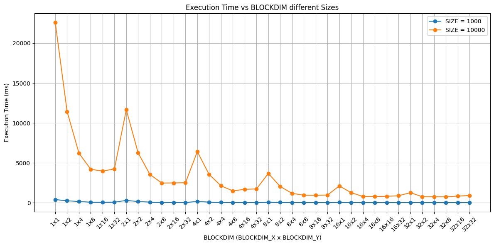

# Introduction

In this report, we aim to accelerate a given program that computes the 2D heat conduction 
formula using CUDA. The primary objective is to evaluate different configurations of 
blocks and threads, as well as various problem sizes, to achieve optimal performance. We 
will conduct a thorough analysis of the code to identify hotspots and discuss potential 
vectorization issues. The best sequential time will be established as a reference point, 
and performance metrics will be presented using Google Colab. The report will include 
charts to illustrate speedup values, focusing on data sizes that result in 
sequential execution times of 30 seconds or more. Finally, we will draw conclusions based 
on our findings.

# Hardware Capability ⚙️

<!-- The VM of google colab is equipped with this CPU:

```c
Architecture:             x86_64
  CPU op-mode(s):         32-bit, 64-bit
  Address sizes:          46 bits physical, 48 bits virtual
  Byte Order:             Little Endian
CPU(s):                   2
  On-line CPU(s) list:    0,1
Vendor ID:                GenuineIntel
  Model name:             Intel(R) Xeon(R) CPU @ 2.20GHz
    CPU family:           6
    Model:                79
    Thread(s) per core:   2
    Core(s) per socket:   1
    Socket(s):            1
    Stepping:             0
    BogoMIPS:             4399.99
    Flags:                fpu vme de pse tsc msr pae mce cx8 apic sep mtrr pge mca cmov pat pse36 cl
                          flush mmx fxsr sse sse2 ss ht syscall nx pdpe1gb rdtscp lm constant_tsc re
                          p_good nopl xtopology nonstop_tsc cpuid tsc_known_freq pni pclmulqdq ssse3
                           fma cx16 pcid sse4_1 sse4_2 x2apic movbe popcnt aes xsave avx f16c rdrand
                           hypervisor lahf_lm abm 3dnowprefetch invpcid_single ssbd ibrs ibpb stibp 
                          fsgsbase tsc_adjust bmi1 hle avx2 smep bmi2 erms invpcid rtm rdseed adx sm
                          ap xsaveopt arat md_clear arch_capabilities
Virtualization features:  
  Hypervisor vendor:      KVM
  Virtualization type:    full
Caches (sum of all):      
  L1d:                    32 KiB (1 instance)
  L1i:                    32 KiB (1 instance)
  L2:                     256 KiB (1 instance)
  L3:                     55 MiB (1 instance)
NUMA:                     
  NUMA node(s):           1
  NUMA node0 CPU(s):      0,1
Vulnerabilities:          
  Gather data sampling:   Not affected
  Itlb multihit:          Not affected
  L1tf:                   Mitigation; PTE Inversion
  Mds:                    Vulnerable; SMT Host state unknown
  Meltdown:               Vulnerable
  Mmio stale data:        Vulnerable
  Reg file data sampling: Not affected
  Retbleed:               Vulnerable
  Spec rstack overflow:   Not affected
  Spec store bypass:      Vulnerable
  Spectre v1:             Vulnerable: __user pointer sanitization and usercopy barriers only; no swa
                          pgs barriers
  Spectre v2:             Vulnerable; IBPB: disabled; STIBP: disabled; PBRSB-eIBRS: Not affected; BH
                          I: Vulnerable (Syscall hardening enabled)
  Srbds:                  Not affected
  Tsx async abort:        Vulnerable
```

We have found those characteristics using this command:

```
!lscpu
``` -->

The VM of google colab is equipped with this GPU:

```bash
+---------------------------------------------------------------------------------------+
| NVIDIA-SMI 535.104.05             Driver Version: 535.104.05   CUDA Version: 12.2     |
|-----------------------------------------+----------------------+----------------------+
| GPU  Name                 Persistence-M | Bus-Id        Disp.A | Volatile Uncorr. ECC |
| Fan  Temp   Perf          Pwr:Usage/Cap |         Memory-Usage | GPU-Util  Compute M. |
|                                         |                      |               MIG M. |
|=========================================+======================+======================|
|   0  Tesla T4                       Off | 00000000:00:04.0 Off |                    0 |
| N/A   36C    P8               9W /  70W |      0MiB / 15360MiB |      0%      Default |
|                                         |                      |                  N/A |
+-----------------------------------------+----------------------+----------------------+
```

We have found those characteristics using the command:

```bash
!nvidia-smi
```

And, through `devicequery`, the output is the following:

```bash
Device 0: "Tesla T4"
  CUDA Driver Version / Runtime Version          12.2 / 12.2
  CUDA Capability Major/Minor version number:    7.5
  Total amount of global memory:                 15102 MBytes (15835660288 bytes)
  (040) Multiprocessors, (064) CUDA Cores/MP:    2560 CUDA Cores
  GPU Max Clock rate:                            1590 MHz (1.59 GHz)
  Memory Clock rate:                             5001 Mhz
  Memory Bus Width:                              256-bit
  L2 Cache Size:                                 4194304 bytes
  Maximum Texture Dimension Size (x,y,z)         1D=(131072), 2D=(131072, 65536), 3D=(16384, 16384, 16384)
  Maximum Layered 1D Texture Size, (num) layers  1D=(32768), 2048 layers
  Maximum Layered 2D Texture Size, (num) layers  2D=(32768, 32768), 2048 layers
  Total amount of constant memory:               65536 bytes
  Total amount of shared memory per block:       49152 bytes
  Total shared memory per multiprocessor:        65536 bytes
  Total number of registers available per block: 65536
  Warp size:                                     32
  Maximum number of threads per multiprocessor:  1024
  Maximum number of threads per block:           1024
  Max dimension size of a thread block (x,y,z): (1024, 1024, 64)
  Max dimension size of a grid size    (x,y,z): (2147483647, 65535, 65535)
  Maximum memory pitch:                          2147483647 bytes
  Texture alignment:                             512 bytes
  Concurrent copy and kernel execution:          Yes with 3 copy engine(s)
  Run time limit on kernels:                     No
  Integrated GPU sharing Host Memory:            No
  Support host page-locked memory mapping:       Yes
  Alignment requirement for Surfaces:            Yes
  Device has ECC support:                        Enabled
  Device supports Unified Addressing (UVA):      Yes
  Device supports Managed Memory:                Yes
  Device supports Compute Preemption:            Yes
  Supports Cooperative Kernel Launch:            Yes
  Supports MultiDevice Co-op Kernel Launch:      Yes
  Device PCI Domain ID / Bus ID / location ID:   0 / 0 / 4
  Compute Mode:
     < Default (multiple host threads can use ::cudaSetDevice() with device simultaneously) >

deviceQuery, CUDA Driver = CUDART, CUDA Driver Version = 12.2, CUDA Runtime Version = 12.2, NumDevs = 1
Result = PASS
```

# Hotspot identification

The nested loops in the `step_kernel_mod` function:

```C
void step_kernel_mod(int ni, int nj, float fact, float* temp_in, float* temp_out) {
  int i00, im10, ip10, i0m1, i0p1;
  float d2tdx2, d2tdy2;

  // loop over all points in domain (except boundary)
  for (int j = 1; j < nj - 1; j++) {
    for (int i = 1; i < ni - 1; i++) {
      // find indices into linear memory
      // for central point and neighbours
      i00 = I2D(ni, i, j);
      im10 = I2D(ni, i - 1, j);
      ip10 = I2D(ni, i + 1, j);
      i0m1 = I2D(ni, i, j - 1);
      i0p1 = I2D(ni, i, j + 1);

      // evaluate derivatives
      d2tdx2 = temp_in[im10] - 2 * temp_in[i00] + temp_in[ip10];
      d2tdy2 = temp_in[i0m1] - 2 * temp_in[i00] + temp_in[i0p1];

      // update temperatures
      temp_out[i00] = temp_in[i00] + fact * (d2tdx2 + d2tdy2);
    }
  }
}
```

This section iterates over nearly every grid point (excluding the boundaries) on a large `SIZExSIZE` matrix for each of the 200 time steps. Each iteration involves multiple memory accesses, that means reading the central cell and its four neighbours. This segment accesses adjacent elements and performs several arithmetic operations to compute the finite difference update, making the routine both compute-bound and memory-bound.

<!-- # Vectorization

```bash
Begin optimization report for: step_kernel_mod

# MAIN HOTSPOT
LOOP BEGIN at hw2/heat_vanilla.c (18, 3)
<Multiversioned v2>
    remark 15319: Loop was not vectorized: novector directive used

    LOOP BEGIN at hw2/heat_vanilla.c (19, 5)
        remark 15319: Loop was not vectorized: novector directive used
    LOOP END
LOOP END
# END MAIN HOTSPOT

LOOP BEGIN at hw2/heat_vanilla.c (18, 3)
<Multiversioned v1>
    remark 15541: loop was not vectorized: outer loop is not an auto-vectorization candidate.

    LOOP BEGIN at hw2/heat_vanilla.c (19, 5)
        remark 15300: LOOP WAS VECTORIZED
        remark 15305: vectorization support: vector length 4
        remark 15389: vectorization support: unmasked unaligned unit stride load: [ /home/leonardo/Github/high-performance-clowns/hw2/heat_vanilla.c (29, 36) ] 
        remark 15389: vectorization support: unmasked unaligned unit stride load: [ /home/leonardo/Github/high-performance-clowns/hw2/heat_vanilla.c (29, 51) ] 
        remark 15389: vectorization support: unmasked unaligned unit stride load: [ /home/leonardo/Github/high-performance-clowns/hw2/heat_vanilla.c (29, 16) ] 
        remark 15389: vectorization support: unmasked unaligned unit stride load: [ /home/leonardo/Github/high-performance-clowns/hw2/heat_vanilla.c (30, 16) ] 
        remark 15389: vectorization support: unmasked unaligned unit stride load: [ /home/leonardo/Github/high-performance-clowns/hw2/heat_vanilla.c (30, 51) ] 
        remark 15389: vectorization support: unmasked unaligned unit stride store: [ /home/leonardo/Github/high-performance-clowns/hw2/heat_vanilla.c (33, 7) ] 
        remark 15475: --- begin vector loop cost summary ---
        remark 15476: scalar cost: 27.000000 
        remark 15477: vector cost: 12.156250 
        remark 15478: estimated potential speedup: 2.187500 
        remark 15309: vectorization support: normalized vectorization overhead 0.234375
        remark 15488: --- end vector loop cost summary ---
        remark 15447: --- begin vector loop memory reference summary ---
        remark 15450: unmasked unaligned unit stride loads: 5 
        remark 15451: unmasked unaligned unit stride stores: 1 
        remark 15474: --- end vector loop memory reference summary ---
    LOOP END

    LOOP BEGIN at hw2/heat_vanilla.c (19, 5)
    <Remainder loop for vectorization>
    LOOP END
LOOP END
```

The vectorization issues in `step_kernel_mod` mainly come from two things:

- **Index Calculation with the I2D Macro**:
    The use of the `I2D` macro makes it harder for the compiler to understand the memory access pattern. This obscurity can prevent the compiler from effectively creating SIMD (vectorized) instructions.

- **Potential Aliasing**:
    The pointers `temp_in` and `temp_out` are not marked with `restrict`. Without `restrict`, the compiler must assume that these pointers might overlap, so it will not optimize the loops as aggressively for vectorization

# Sequential measurements

For retrieving the sequential measurements we have used this code:

```python
SIZES = [1000, 2000, 4000, 6000, 8000, 10000]
times = []

for size in SIZES:
  !make cpu SIZE={size}
  process = subprocess.Popen(['./release/heat'], stdout=subprocess.PIPE, stderr=subprocess.PIPE, text=True)
  stdout, stderr = process.communicate()

  # Extract the time using regex
  match = re.search(r"Elapsed time:\s*([\d.]+)\s*ms", stdout)
  if match:
    time = float(match.group(1))
    times.append(time)
  else:
    print(f"Could not find the time in the output for size {size}")
    print("stdout:", stdout)
    print("stderr:", stderr)
    times.append(None) # append None to keep the list aligned if something goes wrong
```

What we have obtained is this:

| SIZE  | CPU Execution Time (ms) |
| ----- | ----------------------- |
| 1000  | 229.154                 |
| 2000  | 1330.138                |
| 4000  | 6035.192                |
| 6000  | 13611.214               |
| 8000  | 23880.111               |
| 10000 | 36636.103               |


As we can see, the time needed for the program to process a matrix of size=```10000x10000``` is really high. -->

# CUDA implementation

To convert the given algorithm into a CUDA kernel function, we replaced the loops inside the functions with direct calculations of `x` and `y` using `blockIdx`, `blockDim`, and `threadIdx`. \
This transformation enables parallel execution, as demonstrated here:

```C
__global__ void step_kernel_mod_dev(const size_t ni, const size_t nj,
                                    const float fact,
                                    const float* temp_in,
                                    float* temp_out) {
  int i = blockIdx.x * blockDim.x + threadIdx.x;
  int j = blockIdx.y * blockDim.y + threadIdx.y;

  if ((i > 0 && i < ni - 1) && (j > 0 && j < nj - 1)) {
    // indices
    size_t ij = I2D(ni, i, j);
    size_t im1j = I2D(ni, i - 1, j);
    size_t ip1j = I2D(ni, i + 1, j);
    size_t ijm1 = I2D(ni, i, j - 1);
    size_t ijp1 = I2D(ni, i, j + 1);

    // second derivatives
    float dx2 = temp_in[ip1j] - 2.0f * temp_in[ij] + temp_in[im1j];
    float dy2 = temp_in[ijp1] - 2.0f * temp_in[ij] + temp_in[ijm1];

    // update
    temp_out[ij] = temp_in[ij] + fact * (dx2 + dy2);
  }
}
```

# GPU parameters tuning

<!-- ## Generating data

To generate all the data and plot the results we used this code on the Colab notebook:

```python
def run_cuda_cycle(block_x, block_y, size):
    if not os.path.exists("./src/heat.cu"):
        print("Error: Required CUDA source file is missing.")
        return None

    # Compile CUDA code
    compile_cmd = f"nvcc -O3 -arch=sm_75 -D BLOCKDIM_X={block_x} -D BLOCKDIM_Y={block_y} -D SIZE={size} ./src/heat.cu -o ./src/heat_cuda -run"
    result = subprocess.run(compile_cmd, shell=True, capture_output=True, text=True)

    # Extract execution time usin,g regex
    match = re.search(r"GPU time:\s+([\d.]+)\s+ms", result.stderr, re.DOTALL)
    if not match:
        match = re.search(r"GPU time:\s+([\d.]+)\s+ms", result.stdout, re.DOTALL)

    if match:
        execution_time = float(match.group(1))
        print(f"Execution Time: {execution_time} ms")
        return execution_time
    else:
        print("Failed to extract execution time.")
        return None
   
# Store results for visualization
results = []

block_x_values = [1, 2, 4, 8, 16, 32]
block_y_values = [1, 2, 4, 8, 16, 32]
size_values = [1000, 10000]

for block_x in block_x_values:
    for block_y in block_y_values:
        for size in size_values:
            print(f"\nRunning with BLOCKDIM_X={block_x}, BLOCKDIM_Y={block_y}, SIZE={size}")
            time_ms = run_cuda_cycle(block_x, block_y, size)
            if time_ms is not None:
                results.append((block_x, block_y, size, time_ms))

# Convert results into NumPy arrays for easy manipulation
results_array = np.array(results)
``` -->

<!-- ## Results -->

Since we are processing a matrix, it's reasonable to subdivide the cuda threads in a 2D grid. We see from the above section that the GPU used for the measurements has a warp size of $32$ and each block can handle at most $1024$ threads, so at most we will use a `32x32` grid. For different sizes, we tried different configurations and the result are the following:

<div style="display: flex; justify-content: center; align-items: center; width: 100%;">
  <figure style="display: flex; flex-direction: row; justify-content: center; align-items: center;">
    
  </figure>
</div>

| BLOCKDIM_X | BLOCKDIM_Y |  SIZE  | Execution Time (ms) |
| :--------: | :--------: | :----: | :-----------------: |
|     1      |     1      | 1,000  |       397.41        |
|     1      |     2      | 1,000  |       246.01        |
|     1      |     4      | 1,000  |       152.11        |
|     1      |     8      | 1,000  |        67.13        |
|     1      |     16     | 1,000  |        66.79        |
|     1      |     32     | 1,000  |        70.04        |
|     2      |     1      | 1,000  |       290.89        |
|     2      |     2      | 1,000  |       149.05        |
|     2      |     4      | 1,000  |        78.15        |
|     2      |     8      | 1,000  |        34.64        |
|     2      |     16     | 1,000  |        35.81        |
|     2      |     32     | 1,000  |        35.02        |
|     4      |     1      | 1,000  |       153.51        |
|     4      |     2      | 1,000  |        78.01        |
|     4      |     4      | 1,000  |        39.02        |
|     4      |     8      | 1,000  |        18.3         |
|     4      |     16     | 1,000  |        19.51        |
|     4      |     32     | 1,000  |        20.46        |
|     8      |     1      | 1,000  |        76.98        |
|     8      |     2      | 1,000  |        38.94        |
|     8      |     4      | 1,000  |        19.78        |
|     8      |     8      | 1,000  |        10.26        |
|     8      |     16     | 1,000  |        10.36        |
|     8      |     32     | 1,000  |        11.18        |
|     16     |     1      | 1,000  |        39.4         |
|     16     |     2      | 1,000  |        20.17        |
|     16     |     4      | 1,000  |        9.63         |
|     16     |     8      | 1,000  |        9.81         |
|     16     |     16     | 1,000  |        10.57        |
|     16     |     32     | 1,000  |        12.49        |
|     32     |     1      | 1,000  |        20.82        |
|     32     |     2      | 1,000  |        9.54         |
|     32     |     4      | 1,000  |        9.28         |
|     32     |     8      | 1,000  |        9.72         |
|     32     |     16     | 1,000  |        11.2         |
|     32     |     32     | 1,000  |        14.04        |
|     1      |     1      | 10,000 |      22597.21       |
|     1      |     2      | 10,000 |      11428.86       |
|     1      |     4      | 10,000 |       6221.48       |
|     1      |     8      | 10,000 |       4190.27       |
|     1      |     16     | 10,000 |       3964.75       |
|     1      |     32     | 10,000 |       4240.1        |
|     2      |     1      | 10,000 |      11665.04       |
|     2      |     2      | 10,000 |       6243.06       |
|     2      |     4      | 10,000 |       3543.88       |
|     2      |     8      | 10,000 |       2470.83       |
|     2      |     16     | 10,000 |       2483.13       |
|     2      |     32     | 10,000 |       2505.36       |
|     4      |     1      | 10,000 |       6405.87       |
|     4      |     2      | 10,000 |       3541.15       |
|     4      |     4      | 10,000 |       2127.01       |
|     4      |     8      | 10,000 |       1481.12       |
|     4      |     16     | 10,000 |       1680.5        |
|     4      |     32     | 10,000 |       1726.68       |
|     8      |     1      | 10,000 |       3674.55       |
|     8      |     2      | 10,000 |       2042.79       |
|     8      |     4      | 10,000 |       1178.2        |
|     8      |     8      | 10,000 |       941.68        |
|     8      |     16     | 10,000 |       936.52        |
|     8      |     32     | 10,000 |       968.99        |
|     16     |     1      | 10,000 |       2107.46       |
|     16     |     2      | 10,000 |       1255.31       |
|     16     |     4      | 10,000 |       784.81        |
|     16     |     8      | 10,000 |       782.39        |
|     16     |     16     | 10,000 |       804.65        |
|     16     |     32     | 10,000 |       875.15        |
|     32     |     1      | 10,000 |       1261.63       |
|     32     |     2      | 10,000 |       757.64        |
|     32     |     4      | 10,000 |        752.1        |
|     32     |     8      | 10,000 |       741.55        |
|     32     |     16     | 10,000 |       831.59        |
|     32     |     32     | 10,000 |       907.58        |

Each row details:
- **BLOCKDIM_X and BLOCKDIM_Y**: These are the parameters which will define how many
  threads on the X and Y axis will be used per block.
- **SIZE**: The problem size, with values of 1000 and 10000.
- **Execution Time**: The measured time to complete the execution for that configuration.

The results indicate that increasing the problem size generally leads to longer execution times. Additionally, variations in the block dimensions significantly affect performance, suggesting that tuning these parameters can optimize computational efficiency. 
We then will use **`32x8`** threads per block.

```C
dim3 threadsPerBlock(32, 8);
dim3 numBlocks((ni + threadsPerBlock.x - 1) / threadsPerBlock.x, 
               (nj + threadsPerBlock.y - 1) / threadsPerBlock.y);
```

Then the kernel is called by invoking:

```C
step_kernel_mod_dev<<<numBlocks, threadsPerBlock>>>(ni, nj, tfac, temp1_d, temp2_d);
```

## Measurements

We tried on different values for `SIZE`, each measurement has been taken with **`32x8`** threads per block and each thread is given an equal number of cells of the matrix

<div style="display: flex; justify-content: center; align-items: center; width: 100%;">
  <figure style="display: flex; flex-direction: row; justify-content: center; align-items: center;">
    
  </figure>
</div>

| Matrix Size | Execution Time (ms) |
| :---------: | :-----------------: |
|    1,000    |        9.71         |
|    2,000    |        35.74        |
|    4,000    |       137.51        |
|    8,000    |       485.24        |
|   16,000    |       1852.14       |
|   24,000    |       4176.33       |

As we could expect, the bigger the matrix, the more the program takes to execute, but luckily we still remain in a well-sublinear growth

## Performance analysis

The profiling results show that a significant amount of time is consumed by API calls, particularly those related to synchronization and memory transfers. For instance, the call to `cudaEventSynchronize` accounts for about $57.76\%$ of the API call time, indicating that waiting for the GPU operations to complete is a major factor in overall performance. Similarly, the `cudaMemcpy` operations (both `HtoD` and `DtoH`) also contribute substantially, taking up around $34.74\%$ of the API call time. Although the kernel execution (`step_kernel_mod_dev`) represents $62.16\%$ of the GPU activity, these overheads from synchronization and memory transfers are noteworthy and can be a target for further performance optimization.

This is the result of using `nvprof` with **size 10000**:

```c
==22953== Profiling application: ./release/heat_cuda
==22953== Profiling result:
            Type  Time(%)      Time     Calls       Avg       Min       Max  Name
 GPU activities:   62.56%  752.85ms       200  3.7643ms  3.5573ms  4.7968ms  step_kernel_mod_dev(unsigned long, unsigned long, float, float const *, float*)
                   23.40%  281.62ms         1  281.62ms  281.62ms  281.62ms  [CUDA memcpy DtoH]
                   14.04%  168.93ms         2  84.465ms  84.295ms  84.634ms  [CUDA memcpy HtoD]
      API calls:   57.76%  751.87ms         1  751.87ms  751.87ms  751.87ms  cudaEventSynchronize
                   34.74%  452.17ms         3  150.72ms  84.597ms  282.70ms  cudaMemcpy
                    7.18%  93.407ms         2  46.704ms  96.180us  93.311ms  cudaMalloc
                    0.21%  2.6839ms         2  1.3420ms  377.30us  2.3066ms  cudaFree
                    0.11%  1.3747ms       200  6.8730us  4.2770us  253.51us  cudaLaunchKernel
                    0.01%  135.64us       114  1.1890us     106ns  55.544us  cuDeviceGetAttribute
                    0.00%  28.317us         2  14.158us  1.4020us  26.915us  cudaEventCreate
                    0.00%  14.350us         1  14.350us  14.350us  14.350us  cuDeviceGetName
                    0.00%  13.511us         2  6.7550us  5.0980us  8.4130us  cudaEventRecord
                    0.00%  5.8630us         1  5.8630us  5.8630us  5.8630us  cudaEventElapsedTime
                    0.00%  5.4070us         1  5.4070us  5.4070us  5.4070us  cuDeviceGetPCIBusId
                    0.00%  4.7150us         2  2.3570us     761ns  3.9540us  cudaEventDestroy
                    0.00%  2.3020us         3     767ns     210ns  1.7770us  cuDeviceGetCount
                    0.00%  1.3930us         2     696ns     248ns  1.1450us  cuDeviceGet
                    0.00%     496ns         1     496ns     496ns     496ns  cuDeviceTotalMem
                    0.00%     484ns         1     484ns     484ns     484ns  cuModuleGetLoadingMode
                    0.00%     389ns         1     389ns     389ns     389ns  cuDeviceGetUuid
```

With **size 1000**, as we can see the api call impact a lot more than before:

```c
==23404== Profiling application: ./release/heat_cuda
==23404== Profiling result:
            Type  Time(%)      Time     Calls       Avg       Min       Max  Name
 GPU activities:   77.25%  10.432ms       200  52.162us  49.343us  52.671us  step_kernel_mod_dev(unsigned long, unsigned long, float, float const *, float*)
                   12.70%  1.7157ms         1  1.7157ms  1.7157ms  1.7157ms  [CUDA memcpy DtoH]
                   10.05%  1.3572ms         2  678.62us  669.97us  687.28us  [CUDA memcpy HtoD]
      API calls:   85.03%  91.232ms         2  45.616ms  73.698us  91.158ms  cudaMalloc
                    9.09%  9.7520ms         1  9.7520ms  9.7520ms  9.7520ms  cudaEventSynchronize
                    4.42%  4.7398ms         3  1.5799ms  878.97us  2.9776ms  cudaMemcpy
                    0.93%  1.0011ms       200  5.0050us  3.0540us  138.45us  cudaLaunchKernel
                    0.35%  372.55us         2  186.28us  167.63us  204.92us  cudaFree
                    0.13%  136.14us       114  1.1940us     104ns  59.024us  cuDeviceGetAttribute
                    0.02%  20.135us         2  10.067us     673ns  19.462us  cudaEventCreate
                    0.01%  11.201us         2  5.6000us  5.1930us  6.0080us  cudaEventRecord
                    0.01%  11.120us         1  11.120us  11.120us  11.120us  cuDeviceGetName
                    0.01%  5.3930us         1  5.3930us  5.3930us  5.3930us  cuDeviceGetPCIBusId
                    0.00%  3.2210us         1  3.2210us  3.2210us  3.2210us  cudaEventElapsedTime
                    0.00%  3.1450us         2  1.5720us     551ns  2.5940us  cudaEventDestroy
                    0.00%  1.5530us         3     517ns     118ns  1.1850us  cuDeviceGetCount
                    0.00%     774ns         2     387ns     130ns     644ns  cuDeviceGet
                    0.00%     647ns         1     647ns     647ns     647ns  cuModuleGetLoadingMode
                    0.00%     408ns         1     408ns     408ns     408ns  cuDeviceTotalMem
                    0.00%     212ns         1     212ns     212ns     212ns  cuDeviceGetUuid
```

# Conclusions

In this report, we optimized a 2D heat conduction simulation using CUDA and analyzed its performance across different configurations. By identifying computational hotspots in the sequential implementation and leveraging GPU acceleration, we achieved significant speedups.

Our findings highlight that the choice of block and thread configurations greatly impacts performance. Larger block sizes (e.g., BLOCKDIM_X = 4, BLOCKDIM_Y = 8) provided optimal results, reducing execution time substantially compared to smaller configurations.

In conclusion, CUDA acceleration proved highly effective for large-scale heat conduction simulations, with careful tuning of thread-block configurations yielding the best performance.