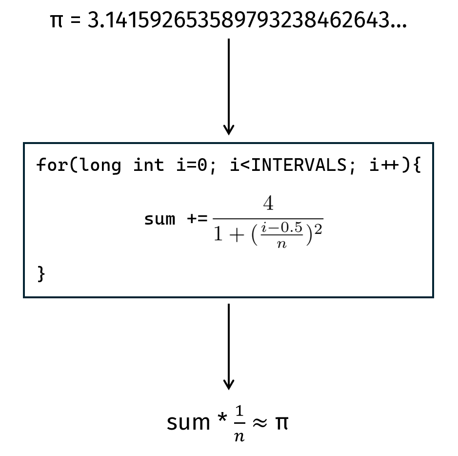
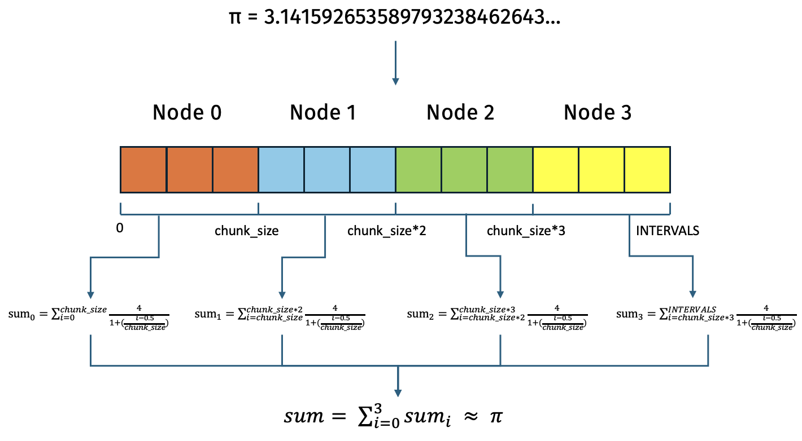

# Assignment 3: MPI

The goal is to distribute the program between the different nodes (in out case different 
processes on the same machine). 

## Algorithm analysis

Given the function

$$f(x) = \frac{4}{1 + x^2}$$

It's proven that the integral in $[0, 1]$ is equal to $\pi$:

$$\int_0^1 f(x)\ dx = \pi$$

Through **midpoint Riemann sums**, this integral can be approximated by:

$$\pi \approx \frac{1}{n} \sum_{i=1}^n \frac{4}{1 + (\frac{i-0.5}{n})^2}$$

$(i - 0.5)/n$ is indeed the midpoint of the $i$-th subinterval. Since it discretizes the integral, it becomes an approximation of $\pi$.

### Parallelization strategy

The sequential case is the following:

<div style="display: flex; align-items: center; width: 100%;">
  <figure style="display: flex; flex-direction: column; justify-content: center; align-items: center;">
    
    <figcaption>Figure 1: sequential case</figcaption>
  </figure>
</div>

As we can see, the sum is performed alltogether on the same node. The simplest yet most powerful way to parallelize this sum is to split the computations on different nodes, making them calculate only a chunk of the total sum.

<div style="display: flex; align-items: center; width: 100%;">
  <figure style="display: flex; flex-direction: column; justify-content: center; align-items: center;">
    
    <figcaption>Figure 2: parallel case</figcaption>
  </figure>
</div>

The final step would be re-aggregate all the partial sums into the same global result, i.e. **reduce** them.

### Workload distribution

Now that we know how the algorithm works, we can decide how to divide the workload in each MPI node. We start by noticing that it is a sum over $n$ elements (in the code $n =$ `INTERVALS`), so, if we have $m$ worker nodes with same resources and performances, we can divide this sum into $m/\texttt{INTERVALS}$ chunks

```c
int size, rank;
MPI_Comm_rank( MPI_COMM_WORLD, &rank );
MPI_Comm_size( MPI_COMM_WORLD, &size );

long int chunk_size = intervals / size;
```

and, for each node, determine the starting index and the ending one:

```c
long int start = rank * chunk_size + 1;
long int end = (rank == size - 1) ? intervals : start + chunk_size - 1;
```

at this point, the local sum on the node is computed

```c
double local_sum = 0.0;
double x, f;
double dx = 1 / (double)intervals; // 1 / n

for (long int i = start; i <= end; i++) {
  x = dx * ((double)(i - 0.5));
  f = 4.0 / (1.0 + x * x);
  local_sum += f;
}
```

At the end of the loop, the local sum on the node will be computed. After this loop, we reduce all the results by summing the partial sums on the master node ($0$ in our case), getting the final result.

```c
double global_sum;
// (send_bf, recv_bf, n_elems, datatype_elems, mpi_op, receiver, comm)
MPI_Reduce(&local_sum, &global_sum, 1, MPI_DOUBLE, MPI_SUM, MASTER_NODE, MPI_COMM_WORLD);

if(rank == MASTER_NODE){
  double pi = dx * global_sum;
  printf("Computed PI %.24f\n", pi);
  printf("The true PI %.24f\n\n", PI25DT);
}
```

## Program optimizations

### Vectorization

Now that the program is distributed, we can thinking at the other optimization aspects. The first thing to tune is the compiler, in our case we used `mpiicx` with all the optimization flag needed. The command ran to compile the program is

```bash
mpiicx -g -O2 -xHost -qopenmp -qopt-report=3 -ffast-math pi_homework.c
```

while the one to execute it is

```bash
mpirun -np 10 ./pi_homework
```

### Parallelization

Another way to improve the performances is to use multithreading. We used **OpenMP** to parallelize the MPI code in this way:

```c
omp_set_num_threads(20);
#pragma omp parallel for private(x, f) reduction(+ : local_sum)
for (i = start; i <= end; i++) {
  x = dx * ((double)(i - 0.5));
  f = 4.0 / (1.0 + x * x);
  local_sum += f;
}
```

That is, simply subdivide the for loop on different threads and apply the reduction on the sum.

## Statistics

**sequential (best)**

|    INTERVALS    | Time (s) | GFLOPS | GINTOPS |             Hotspots             |
| :-------------: | :------: | :----: | :-----: | :------------------------------: |
|  1,000,000,000  |   0.62   |  9.75  |  2.11   | loop in main at pi_homework.c:26 |
| 10,000,000,000  |   5.87   | 10.22  |  1.22   | loop in main at pi_homework.c:26 |
| 100,000,000,000 |  58.68   | 10.22  |  1.22   | loop in main at pi_homework.c:26 |

**parallel**

|    INTERVALS    | Time (s) | GFLOPS | GINTOPS |             Hotspots             | Time per Core (s) |
| :-------------: | :------: | :----: | :-----: | :------------------------------: | :---------------: |
|  1,000,000,000  |   0.11   | 53.68  |  15.66  | loop in main at pi_homework.c:26 |       0.05        |
| 10,000,000,000  |   0.88   | 73.02  |  21.30  | loop in main at pi_homework.c:26 |        0.6        |
| 100,000,000,000 |   7.81   | 76.85  |  22.41  | loop in main at pi_homework.c:26 |       6.28        |

We can easely see that the parallel and distributed program is much faster, with a speedup of

**speedup**

|    INTERVALS    | Sequential time (s) | Parallel time (s) | Speedup  |
| :-------------: | :-----------------: | :---------------: | :------: |
|  1,000,000,000  |        0.62         |       0.11        | **5.64** |
| 10,000,000,000  |        5.87         |       0.88        | **6.67** |
| 100,000,000,000 |        58.68        |       7.81        | **7.51** |

The speedup increases with the number of intervals, showing the efficiency of the parallel and distributed approach.

# TODO

- take the performances of the MPI - sequential and MPI - parallel