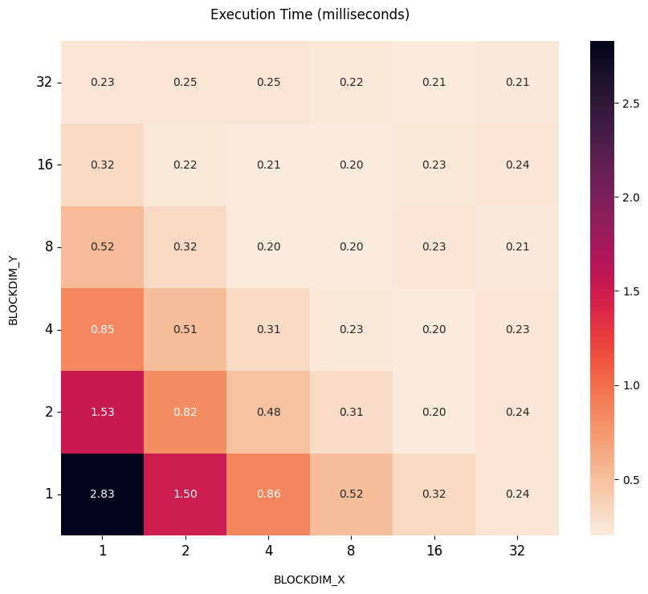
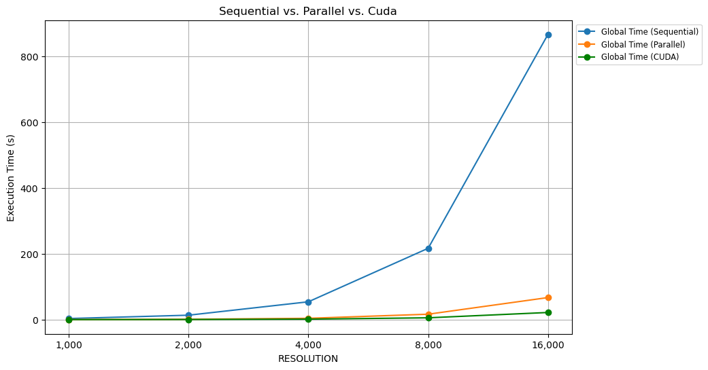

<!-- # prof instructions

## you must conclude with a discussion and comparison of the performance achievable in the three cases. Incomplete (e.g. qualitative and not quantitative) reports will be rejected. In particular

- describe always the compute capability of the resource you are using;
- use ICC/ICX on our workstations, GCC with Colab;
- use the BEST sequential execution time;
- always provide the compilation and execution commands (e.g. icc -O3 -xHost...);
- consider different and meaningful data sizes (i.e. no sequential execution time shorter than a few seconds). 7 -->
# HPC final project
### Leonardo Gonfiantini, Enrico Pezzano, Christian Parodi

# Introduction

In this project, we explore the performance of the Mandelbrot set computation using different optimization techniques and hardware capabilities. The goal is to analyze and compare the execution times and efficiencies of various implementations, including sequential and parallel versions. We will utilize the SW2 workstations for our experiments, leveraging the ICPX compiler to evaluate the impact on performance. We will then utilize the CUDA compiler with Google Colab and, in the end, we will compare the differences in the analysis.
By examining different data sizes and providing detailed hotspot analysis, we aim to gain a comprehensive understanding of the factors influencing the performance of the Mandelbrot set computation and the differences in performances between the different implementations and compilers.

### Hardware Capabilities ⚙️

Like for the three assignments, we executed the C++ code using the Software 2 (SW2) workstations, with the following characteristics.

<div style="display: flex; justify-content: center; align-items: center; width: 100%;">
  <figure style="display: flex; flex-direction: column; justify-content: center; align-items: center;">
    
  </figure>
</div>

Instead, using the command:

```bash
!nvcc devicequery/devicequery.cu -o devicequery/devicequery_main -run
```

we obtained these hardware characteristics on the Google Colab environment

```sh
Device 0: "Tesla T4"
  CUDA Driver Version / Runtime Version          12.2 / 12.2
  CUDA Capability Major/Minor version number:    7.5
  Total amount of global memory:                 15102 MBytes (15835660288 bytes)
  (040) Multiprocessors, (064) CUDA Cores/MP:    2560 CUDA Cores
  GPU Max Clock rate:                            1590 MHz (1.59 GHz)
  Memory Clock rate:                             5001 Mhz
  Memory Bus Width:                              256-bit
  L2 Cache Size:                                 4194304 bytes
  Maximum Texture Dimension Size (x,y,z)         1D=(131072), 2D=(131072, 65536), 3D=(16384, 16384, 16384)
  Maximum Layered 1D Texture Size, (num) layers  1D=(32768), 2048 layers
  Maximum Layered 2D Texture Size, (num) layers  2D=(32768, 32768), 2048 layers
  Total amount of constant memory:               65536 bytes
  Total amount of shared memory per block:       49152 bytes
  Total shared memory per multiprocessor:        65536 bytes
  Total number of registers available per block: 65536
  Warp size:                                     32
  Maximum number of threads per multiprocessor:  1024
  Maximum number of threads per block:           1024
  Max dimension size of a thread block (x,y,z): (1024, 1024, 64)
  Max dimension size of a grid size    (x,y,z): (2147483647, 65535, 65535)
  Maximum memory pitch:                          2147483647 bytes
  Texture alignment:                             512 bytes
  Concurrent copy and kernel execution:          Yes with 3 copy engine(s)
  Run time limit on kernels:                     No
  Integrated GPU sharing Host Memory:            No
  Support host page-locked memory mapping:       Yes
  Alignment requirement for Surfaces:            Yes
  Device has ECC support:                        Enabled
  Device supports Unified Addressing (UVA):      Yes
  Device supports Managed Memory:                Yes
  Device supports Compute Preemption:            Yes
  Supports Cooperative Kernel Launch:            Yes
  Supports MultiDevice Co-op Kernel Launch:      Yes
  Device PCI Domain ID / Bus ID / location ID:   0 / 0 / 4
  Compute Mode:
     < Default (multiple host threads can use ::cudaSetDevice() with device simultaneously) >

deviceQuery, CUDA Driver = CUDART, CUDA Driver Version = 12.2, CUDA Runtime Version = 12.2, NumDevs = 1
Result = PASS
```

# Algorithm analysis

The Mandelbrot set is a collection of complex numbers that produces a well-known fractal when visualized. It is defined through an iterative process. Specifically, for a given complex number $c$, we define the sequence:

$$
z_{0} = 0, \quad z_{n+1} = z_n^2 + c, \quad n \geq 0.
$$

The Mandelbrot set, denoted by $M$, consists of all values of $c$ for which the sequence $\{ z_n \}$ remains *bounded*. In formal terms:

$$
M = \left\{ c \in \mathbb{C} : \limsup_{n \rightarrow \infty} |z_n| \leq 2 \right\}.
$$

In practice, the condition for divergence is determined by checking whether the magnitude $|
z_n|$ exceeds $2$ for some iteration $n$. If $|z_n| > 2$, the sequence will diverge to 
infinity.

Thus, the Mandelbrot set is given by all complex numbers $c$ such that the iterative process maintains $|z_n|$ below or equal to $2$ indefinitely.

Algorithm-wise, **the goal is counting how many times we need to compute $z_{n+1} = z_n + c$ for it to be $\ge 2$**

# Hotspot analysis

The main hotspot in the code is the following:

```cpp
for (int pos = 0; pos < HEIGHT * WIDTH; pos++) {
  image[pos] = 0;

  const int row = pos / WIDTH;
  const int col = pos % WIDTH;
  const complex<double> c(col * STEP + MIN_X, row * STEP + MIN_Y);

  // z = z^2 + c
  z = complex<double>(0, 0);
  for (int i = 1; i <= ITERATIONS; i++) {
    z = pow(z, 2) + c;

    // If it diverges
    if (abs(z) >= 2) {
      image[pos] = i;
      break;
    }
  }
}
```

taking $\approx 99.6\%$ of the actual execution time (not counting the write to file). We also denote that **the parameter that makes the computation heavier is `RESOLUTION`**, as `WIDTH` and `HEIGHT` depends on it.

# Compiler optimizations

## CPU

The best sequential execution time is obtained by compiling with

```bash
icpx -g -O3 -march=native -qopenmp -qopt-report=3 -ffast-math \
  -D RESOLUTION=... \
  ./src/mandelbrot.cpp -o ./release/mandelbrot
```

In this way, the code is vectorized, everything is optimized depending on the architecture and a level 3 optimization is applied.

## GPU

Regarding the CUDA version, the `.cu` file is compiled with

```bash
nvcc -O3 -arch=sm_75  \
  -D RESOLUTION=... \
  ./src/mandelbrot.cu -o ./release/mandelbrot_cuda
```

Also here we specified level 3 compiler optimizations and, based on the results of `devicequery`, the GPU architecture `sm_75`.

# Code analysis and optimizations

The output of the program is a file that, when displayed, shows the Mandelbrot set. We rapidly see that the `RESOLUTION` parameters is the one that determines the execution time, as `WIDTH` and `HEIGHT` depend on it. As we may expect, it regulates how detailed is the result.

<div style="display: flex; justify-content: center; align-items: center; width: 100%;">
  <figure style="display: flex; flex-direction: column; justify-content: center; align-items: center;">
    
    <figcaption>RESOLUTION=1000</figcaption>
  </figure>
  <figure style="display: flex; flex-direction: column; justify-content: center; align-items: center;">
    
    <figcaption>RESOLUTION=4000</figcaption>
  </figure>
</div>

We saw that the main hotspot has two nested loops, and we may think that vectorizing and parallelizing both may be the best choice. The problem is that the inner loop presents a **Read after Write dependency**, as the computation at time $t$ of $z$ (we call it $z_t$) depends on $z_{t-1} \implies$ $z_t = z_{t-1} + c$. Since this dependency is inherited by the definition of Mandelbrot set, we cannot make any adjustment to remove it.

## CPU

We parallelize the main hotspot

```cpp
#pragma omp parallel for num_threads(NUM_THREADS) private(z) schedule(dynamic)
for (int pos = 0; pos < HEIGHT * WIDTH; pos++) {
  image[pos] = 0;

  const int row = pos / WIDTH;
  const int col = pos % WIDTH;
  const complex<double> c(col * STEP + MIN_X, row * STEP + MIN_Y);

  // z = z^2 + c
  z = complex<double>(0, 0);
  for (int i = 1; i <= ITERATIONS; i++) {
    // RaW DEPENDENCY:
    // z[t] = z[t-1]^2 + c
    // not vectorizable
    z = z * z + c;

    // If it diverges
    if (abs(z) >= 2) {
      image[pos] = i;
      break;
    }
  }
}
```

The `#pragma` directive tells the compiler to parallelize the for loop using `NUM_THREADS` threads, keeping `z` private for each thread and schedule the workload dynamically, as the computation may vary depending on how heavy is `z = z^2 + c` resource-wise.

## CUDA

`image` is a matrix with `HEIGHT` rows and `WIDTH` columns, so defining a grid-like  structure for the cuda threads is reasonable. From the execution of `devicequery`, we know that on Google Colab the GPU has the following characteristics:

```bash
...
Warp size: 32
Maximum number of threads per block: 1024
Max dimension size of a thread block (x,y,z): (1024, 1024, 64)
...
```

The _warp size_ indicates how many threads can be executed at once, in this GPU those are $32$. The max number of threads per blocks indicates that, at most, we can build a thread grid of $1024$ total threads.

### CUDA thread grid configuration 

<div style="display: flex; justify-content: center; align-items: center; width: 100%;">
  <figure style="display: flex; flex-direction: column; justify-content: center; align-items: center;">
    
  </figure>
</div>


### Parallel schedule in function of #threads 

<div style="display: flex; justify-content: center; align-items: center; width: 100%;">
  <figure style="display: flex; flex-direction: column; justify-content: center; align-items: center;">
    
  </figure>
</div>

<div style="display: flex; justify-content: center; align-items: center; width: 100%;">
  <figure style="display: flex; flex-direction: column; justify-content: center; align-items: center;">
    
  </figure>
</div>

<div style="display: flex; justify-content: center; align-items: center; width: 100%;">
  <figure style="display: flex; flex-direction: column; justify-content: center; align-items: center;">
    
  </figure>
</div>


#### CUDA thread grid table

These values are in milliseconds.

| BLOCKDIM_Y \ BLOCKDIM_X | 1    | 2    | 4   | 8   | 16  | 32  |
| ----------------------- | ---- | ---- | --- | --- | --- | --- |
| **32**                  | 235  | 247  | 247 | 220 | 208 | 209 |
| **16**                  | 315  | 221  | 206 | 199 | 225 | 239 |
| **8**                   | 518  | 323  | 198 | 205 | 235 | 210 |
| **4**                   | 852  | 512  | 313 | 226 | 203 | 230 |
| **2**                   | 1530 | 816  | 481 | 307 | 198 | 238 |
| **1**                   | 2827 | 1499 | 863 | 515 | 323 | 243 |

Based on our experiments, we decided to use a $32 \times 32 = 1024$ threads grid.

```cpp
dim3 threadsPerBlock(32, 32);
dim3 numBlocks((HEIGHT + threadsPerBlock.x - 1) / threadsPerBlock.x, 
               (WIDTH + threadsPerBlock.y - 1) / threadsPerBlock.y);
```

In this way, the matrix is equally subdivided throughout the $1024$ threads. Finally, the CUDA kernel is defined as follows:

```cpp
// the std namespace cannot be used on the device,
// so we define a (oversimplified) version of std::complex
struct complex {
  double re;
  double im;

  // for z = a + bi, |z|^2 = a^2 + b^2.
  __device__ double abs2() const {
    return re * re + im * im;
  }

  // for z = a + bi, z^2 = (a^2 - b^2) + 2abi
  __device__ complex square() {
    return {re * re - im * im, 2.0 * re * im};
  }

  // for z = a + bi and w = c + di, z + w = (a + c) + (b + d)i
  __device__ complex operator+(const complex& w) const {
    return {this->re + w.re, this->im + w.im};
  }
};

__global__ void mandelbrot_kernel(int *const image) {
  int col = blockIdx.x * blockDim.x + threadIdx.x;
  int row = blockIdx.y * blockDim.y + threadIdx.y;

  if (col >= WIDTH || row >= HEIGHT)
    return;

  int pos = row * WIDTH + col;

  image[pos] = 0;

  complex c = {col * STEP + MIN_X, row * STEP + MIN_Y};
  complex z = {0.0, 0.0};
  for (int i = 1; i <= ITERATIONS; i++) {
    // z = z^2 + c
    z = z.square() + c;

    // If it is convergent
    if (z.abs2() >= 4.0) {  // if abs > 2.0, then abs^2 > 4.0
      image[pos] = i;
      return;
    }
  }
}
```

# Execution Times and Performance Analysis

For our experiments, we selected different values for `RESOLUTION`, as `WIDTH` and `HEIGHT` directly depends on it, and so does the computation. We decided to exclude the part of the code that writes the result into a file, as it is not relevant in the analysis of the algorithm performances; Thus, the following statistics are referring to the algorithm part alone. The sequential/parallel code has been executed on the machines in SW2 and the CUDA version has been executed on Google Colab, both with the hardware capabilities explained at the beginning of this report.

We could not plot the result of the program for `RESOLUTION` $>\ \approx 8000$, because the resulting file in that case would weight around $1.4\texttt{GB}$ and the machines we were equipped with had not enought RAM to load it and print it.

<div style="display: flex; justify-content: center; align-items: center; width: 100%;">
  <figure style="display: flex; flex-direction: column; justify-content: center; align-items: center;">
  
  </figure>
</div>

<div style="display: flex; justify-content: center; align-items: center; width: 100%;">
  <figure style="display: flex; flex-direction: column; justify-content: center; align-items: center;">
  
  </figure>
</div>

### Sequential data

| RESOLUTION | Time (s) | Hotspot Time (s) |
| :--------: | :------: | :--------------: |
|   1,000    |   3.39   |       3.38       |
|   2,000    |  13.56   |      13.54       |
|   4,000    |  54.27   |      54.21       |
|   8,000    |  216.93  |      216.41      |
|   16,000   |  867.14  |      866.97      |

### Parallel data

| RESOLUTION | Time (s) | Hotspot Time (s) |
| :--------: | :------: | :--------------: |
|   1,000    |   0.28   |       0.23       |
|   2,000    |   1.07   |       0.93       |
|   4,000    |   4.08   |       3.85       |
|   8,000    |  16.53   |      15.65       |
|   16,000   |  67.14   |      63.82       |

### CUDA data

| RESOLUTION | Time (s) |
| :--------: | :------: |
|   1,000    |   0.22   |
|   2,000    |   0.51   |
|   4,000    |   1.53   |
|   8,000    |   5.61   |
|   16,000   |  21.77   |

We immediately see an abrupt change performance-wise in the CUDA version, reaching a speedup of $\approx 40\texttt{x}$ at the maximum `RESOLUTION`. Time-wise, a sequential execution of about $\approx$ **14 minutes** became a CUDA exection of $\approx$ **20 seconds**

# Conclusions

The experiments demonstrate significant performance gains, particularly when using GPU acceleration compared to a highly optimized CPU implementation. In contrast, the CUDA implementation on Google Colab, compiled with nvcc and optimized for the Tesla T4 architecture (sm_75), reduced execution times dramatically, achieving up to a 40× speedup for high-resolution workloads.