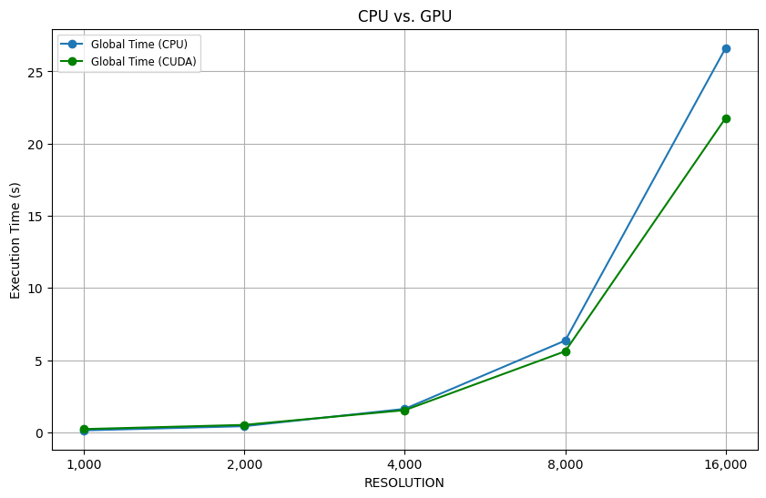

<!-- # prof instructions

## you must conclude with a discussion and comparison of the performance achievable in the three cases. Incomplete (e.g. qualitative and not quantitative) reports will be rejected. In particular

- describe always the compute capability of the resource you are using;
- use ICC/ICX on our workstations, GCC with Colab;
- use the BEST sequential execution time;
- always provide the compilation and execution commands (e.g. icc -O3 -xHost...);
- consider different and meaningful data sizes (i.e. no sequential execution time shorter than a few seconds). 7 -->
# HPC - Mandelbrot report 🏎️ 💻
### Leonardo Gonfiantini, Enrico Pezzano, Christian Parodi

# Introduction 🎬

In this project, we explore the performance of the Mandelbrot set computation using different optimization techniques and hardware capabilities. The goal is to analyze and compare the execution times and efficiencies of various implementations, including sequential and parallel versions. We will utilize the SW2 workstations for our experiments, leveraging the ICPX compiler to evaluate the impact on performance. We will then utilize the CUDA compiler with Google Colab and, in the end, we will compare the differences in the analysis.
By examining different data sizes and providing detailed hotspot analysis, we aim to gain a comprehensive understanding of the factors influencing the performance of the Mandelbrot set computation and the differences in performances between the different implementations and compilers.

### Hardware Capabilities ⚙️

Like in the three assignments, we executed the C++ code using the Software 2 (SW2) workstations, with the following characteristics.

<div style="display: flex; justify-content: center; align-items: center; width: 100%;">
  <figure style="display: flex; flex-direction: column; justify-content: center; align-items: center;">
    
  </figure>
</div>

Instead, using the command:

```bash
!nvcc devicequery/devicequery.cu -o devicequery/devicequery_main -run
```

we obtained these hardware characteristics on the Google Colab environment

```sh
Device 0: "Tesla T4"
  CUDA Driver Version / Runtime Version          12.2 / 12.2
  CUDA Capability Major/Minor version number:    7.5
  Total amount of global memory:                 15102 MBytes (15835660288 bytes)
  (040) Multiprocessors, (064) CUDA Cores/MP:    2560 CUDA Cores
  GPU Max Clock rate:                            1590 MHz (1.59 GHz)
  Memory Clock rate:                             5001 Mhz
  Memory Bus Width:                              256-bit
  L2 Cache Size:                                 4194304 bytes
  Maximum Texture Dimension Size (x,y,z)         1D=(131072), 2D=(131072, 65536), 3D=(16384, 16384, 16384)
  Maximum Layered 1D Texture Size, (num) layers  1D=(32768), 2048 layers
  Maximum Layered 2D Texture Size, (num) layers  2D=(32768, 32768), 2048 layers
  Total amount of constant memory:               65536 bytes
  Total amount of shared memory per block:       49152 bytes
  Total shared memory per multiprocessor:        65536 bytes
  Total number of registers available per block: 65536
  Warp size:                                     32
  Maximum number of threads per multiprocessor:  1024
  Maximum number of threads per block:           1024
  Max dimension size of a thread block (x,y,z): (1024, 1024, 64)
  Max dimension size of a grid size    (x,y,z): (2147483647, 65535, 65535)
  Maximum memory pitch:                          2147483647 bytes
  Texture alignment:                             512 bytes
  Concurrent copy and kernel execution:          Yes with 3 copy engine(s)
  Run time limit on kernels:                     No
  Integrated GPU sharing Host Memory:            No
  Support host page-locked memory mapping:       Yes
  Alignment requirement for Surfaces:            Yes
  Device has ECC support:                        Enabled
  Device supports Unified Addressing (UVA):      Yes
  Device supports Managed Memory:                Yes
  Device supports Compute Preemption:            Yes
  Supports Cooperative Kernel Launch:            Yes
  Supports MultiDevice Co-op Kernel Launch:      Yes
  Device PCI Domain ID / Bus ID / location ID:   0 / 0 / 4
  Compute Mode:
     < Default (multiple host threads can use ::cudaSetDevice() with device simultaneously) >

deviceQuery, CUDA Driver = CUDART, CUDA Driver Version = 12.2, CUDA Runtime Version = 12.2, NumDevs = 1
Result = PASS
```

# Algorithm analysis 👨🏻‍💻

The Mandelbrot set is a collection of complex numbers that produces a well known fractal when visualized. It is defined through an iterative process. Specifically, for a given complex number $c$, we define the sequence:

$$
z_{0} = 0, \quad z_{n+1} = z_n^2 + c, \quad n \geq 0.
$$

The Mandelbrot set, denoted by $M$, consists of all values of $c$ for which the sequence $\{ z_n \}$ remains *bounded*. In formal terms:

$$
M = \left\{ c \in \mathbb{C} : \limsup_{n \rightarrow \infty} |z_n| \leq 2 \right\}.
$$

In practice, the condition for divergence is determined by checking whether the magnitude $|z_n|$ exceeds $2$ for some iteration $n$. If $|z_n| > 2$, the sequence will diverge to infinity.

Thus, the Mandelbrot set is given by all complex numbers $c$ such that the iterative process maintains $|z_n|$ below or equal to $2$ indefinitely.

Algorithm-wise, **the goal is counting how many times we need to compute $z_{n+1} = z_n + c$ for it to be $\ge 2$**

# Hotspot analysis 🔥

The main hotspot in the code is the following:

```cpp
for (int pos = 0; pos < HEIGHT * WIDTH; pos++) {
  image[pos] = 0;

  const int row = pos / WIDTH;
  const int col = pos % WIDTH;
  const complex<double> c(col * STEP + MIN_X, row * STEP + MIN_Y);

  // z = z^2 + c
  z = complex<double>(0, 0);
  for (int i = 1; i <= ITERATIONS; i++) {
    z = pow(z, 2) + c;

    // If it diverges
    if (abs(z) >= 2) {
      image[pos] = i;
      break;
    }
  }
}
```

taking $\approx 99.6\%$ of the actual execution time (not counting the file write). We also denote that **the parameter that makes the computation heavier is `RESOLUTION`**, as `WIDTH` and `HEIGHT` depends on it.

# Compiler optimizations 🦾

## CPU 🧠

The best sequential execution time is obtained by compiling with

```bash
icpx -g -O3 -march=native -qopenmp -qopt-report=3 -ffast-math \
  -D RESOLUTION=... \
  ./src/mandelbrot.cpp -o ./release/mandelbrot
```

In this way, the code is vectorized, everything is optimized depending on the architecture and a level 3 optimization is applied.

## GPU 📹

Regarding the CUDA version, the `.cu` file is compiled with

```bash
nvcc -O3 -arch=sm_75  \
  -D RESOLUTION=... \
  ./src/mandelbrot.cu -o ./release/mandelbrot_cuda
```

Also here we specified level 3 compiler optimizations and, based on the results of `devicequery`, the GPU architecture `sm_75`.

# Code analysis and optimizations 📈

The output of the program is a file that, when displayed, shows the Mandelbrot set. We rapidly see that the `RESOLUTION` parameters is the one that determines the execution time, as `WIDTH` and `HEIGHT` depend on it. As we may expect, it regulates how detailed is the result.

<div style="display: flex; justify-content: center; align-items: center; width: 100%;">
  <figure style="display: flex; flex-direction: column; justify-content: center; align-items: center;">
    
    <figcaption>RESOLUTION=1000</figcaption>
  </figure>
  <figure style="display: flex; flex-direction: column; justify-content: center; align-items: center;">
    
    <figcaption>RESOLUTION=4000</figcaption>
  </figure>
</div>

We saw that the main hotspot has two nested loops, and we may think that vectorizing and parallelizing both may be the best choice. The problem is that the inner loop presents a **Read after Write dependency**, as the computation at time $t$ of $z$ (we call it $z_t$) depends on $z_{t-1} \implies$ $z_{t+1} = z^2_t + c$. Since this dependency is inherited by the definition of Mandelbrot set, we cannot make any adjustment to remove it without changing the original code.

## CPU 🧠

Taking a look to the report generated by the intel compiler, we see a couple problems

```bash
Begin optimization report for: main

# Outer-most loop
LOOP BEGIN at ./src/mandelbrot.cpp (56, 3)
    remark 25408: memset generated
    remark 15541: loop was not vectorized: outer loop is not an auto-vectorization candidate.

    # Inner-most loop
    LOOP BEGIN at ./src/mandelbrot.cpp (65, 5)
        remark 25530: Stmt at line 0 sinked after loop using last value computation
        remark 15344: Loop was not vectorized: vector dependence prevents vectorization
        remark 15346: vector dependence: assumed FLOW dependence between z __r __t [ /usr/lib/gcc/x86_64-linux-gnu/13/../../../../include/c++/13/complex (1619, 13) ] and z __r __t [ /usr/lib/gcc/x86_64-linux-gnu/13/../../../../include/c++/13/complex (1636, 13) ] 
        remark 15346: vector dependence: assumed FLOW dependence between z __r __t [ /usr/lib/gcc/x86_64-linux-gnu/13/../../../../include/c++/13/complex (1619, 13) ] and z __r __t [ /usr/lib/gcc/x86_64-linux-gnu/13/../../../../include/c++/13/complex (1636, 13) ] 
        remark 15346: vector dependence: assumed FLOW dependence between z __r __t [ /usr/lib/gcc/x86_64-linux-gnu/13/../../../../include/c++/13/complex (1619, 13) ] and z __r __t 
        remark 15346: vector dependence: assumed FLOW dependence between z __r __t [ /usr/lib/gcc/x86_64-linux-gnu/13/../../../../include/c++/13/complex (1619, 13) ] and z __r __t [ /usr/lib/gcc/x86_64-linux-gnu/13/../../../../include/c++/13/complex (1636, 13) ] 
        remark 15346: vector dependence: assumed FLOW dependence between z __r __t [ /usr/lib/gcc/x86_64-linux-gnu/13/../../../../include/c++/13/complex (1619, 13) ] and z __r __t [ /usr/lib/gcc/x86_64-linux-gnu/13/../../../../include/c++/13/complex (1636, 13) ] 
        remark 15346: vector dependence: assumed FLOW dependence between z __r __t [ /usr/lib/gcc/x86_64-linux-gnu/13/../../../../include/c++/13/complex (1619, 13) ] and z __r __t [ /usr/lib/gcc/x86_64-linux-gnu/13/../../../../include/c++/13/complex (1636, 13) ] 
        remark 25438: Loop unrolled without remainder by 2
    LOOP END
LOOP END

LOOP BEGIN at ./src/mandelbrot.cpp (98, 5)

    LOOP BEGIN at ./src/mandelbrot.cpp (98, 5)
    LOOP END
LOOP END
=================================================================
```

We confirm the fact that the automatic vectorization does not occur. We rewrote the code of the main hotspot in order for it to be optimized and vectorized for the best instruction set available on the SW2 machine (i.e. `AVX2`):

```cpp
 // 4 pixels in parallel
for (int pos = 0; pos < totalPixels; pos += 4) {
  // z = 0
  __m256d z_real = _mm256_setzero_pd();
  __m256d z_imag = _mm256_setzero_pd();

  // c for 4 pixels
  __m256d c_real = _mm256_set_pd(
      ((pos + 3) % WIDTH) * STEP + MIN_X,
      ((pos + 2) % WIDTH) * STEP + MIN_X,
      ((pos + 1) % WIDTH) * STEP + MIN_X,
      (pos % WIDTH) * STEP + MIN_X);
  __m256d c_imag = _mm256_set_pd(
      ((pos + 3) / WIDTH) * STEP + MIN_Y,
      ((pos + 2) / WIDTH) * STEP + MIN_Y,
      ((pos + 1) / WIDTH) * STEP + MIN_Y,
      (pos / WIDTH) * STEP + MIN_Y);

  // active mask: each lane is active (all bits 1)
  __m256d active = _mm256_castsi256_pd(_mm256_set1_epi32(-1));
  for (int i = 1; i <= ITERATIONS; i++) {
    // z^2
    __m256d z_real_sq = _mm256_mul_pd(z_real, z_real);
    __m256d z_imag_sq = _mm256_mul_pd(z_imag, z_imag);
    // z_real^2 - z_imag^2 + c_real
    __m256d new_z_real = _mm256_add_pd(_mm256_sub_pd(z_real_sq, z_imag_sq), c_real);
    // 2*z_real*z_imag + c_imag
    __m256d new_z_imag = _mm256_add_pd(_mm256_mul_pd(_mm256_set1_pd(2.0), _mm256_mul_pd(z_real, z_imag)), c_imag);

    // update active lanes
    z_real = _mm256_blendv_pd(z_real, new_z_real, active);
    z_imag = _mm256_blendv_pd(z_imag, new_z_imag, active);

    // |z|^2 = z_real^2 + z_imag^2
    __m256d mag_sq = _mm256_add_pd(_mm256_mul_pd(z_real, z_real),
                                    _mm256_mul_pd(z_imag, z_imag));
    // |z|^2 >= 4.
    __m256d diverged_mask = _mm256_cmp_pd(mag_sq, _mm256_set1_pd(4.0), _CMP_GE_OQ);
    int diverged = _mm256_movemask_pd(diverged_mask);
    if (diverged) {                  // if any of the 4 pixel diverged
      for (int j = 0; j < 4; ++j) {  
        if (diverged & (1 << j)) {   // if the j-th pixel diverged
          image[pos + j] = i;
        }
      }
      // remove diverged lanes from future iterations
      active = _mm256_andnot_pd(diverged_mask, active);
      if (_mm256_movemask_pd(active) == 0)
        break;
    }
  }

  // for pixels that never diverged, assign the maximum iteration count
  int still_active = _mm256_movemask_pd(active);
  if (still_active) {
    for (int j = 0; j < 4; ++j) {
      if (still_active & (1 << j)) {
        image[pos + j] = 0;
      }
    }
  }
}
```

It is for sure more complex, long and low level with respect to the original one, but it is also much faster. For example, the original code compiled in a sequential fashion (no multithreading)
executed in 17 seconds, this version compiled with the same flags and parameters executes in 4 seconds.

### Parallelization 🛤️

We parallelized the main hotspot with

```cpp
#pragma omp parallel for num_threads(NUM_THREADS) schedule(OMP_SCHEDULE)
```

This `#pragma` directive tells the compiler to parallelize the for loop using `NUM_THREADS` threads and select the schedule `OMP_SCHEDULE`. We can infer that as the computation may vary depending on how heavy is `z = z^2 + c`, `OMP_SCHEDULE` will be either `dynamic` or `guided`.

### Schedule choice in function of the #threads 

<div style="display: flex; justify-content: center; align-items: center; width: 100%;">
  <figure style="display: flex; flex-direction: column; justify-content: center; align-items: center;">
    
  </figure>
</div>

<div style="display: flex; justify-content: center; align-items: center; width: 100%;">
  <figure style="display: flex; flex-direction: column; justify-content: center; align-items: center;">
    
  </figure>
</div>

<div style="display: flex; justify-content: center; align-items: center; width: 100%;">
  <figure style="display: flex; flex-direction: column; justify-content: center; align-items: center;">
    
  </figure>
</div>

After a careful examination on the above Mandelbrot execution time results, we can conclude that, in this case, the **guided schedule** and **20 threads** is the best strategy for this algorithm. 

## CUDA ⏩

`image` is a matrix with `HEIGHT` rows and `WIDTH` columns, so defining a grid-like  structure for the cuda threads is reasonable. From the execution of `devicequery`, we know that on Google Colab the GPU has the following characteristics:

```bash
...
Warp size: 32
Maximum number of threads per block: 1024
Max dimension size of a thread block (x,y,z): (1024, 1024, 64)
...
```
The warp size determines the number of threads that can be executed concurrently. For this GPU, that number is $32$. Additionally, the maximum number of threads per block is $1024$, so at most we can create a `32x32` grid.

### CUDA thread grid configuration ⏩

<div style="display: flex; justify-content: center; align-items: center; width: 100%;">
  <figure style="display: flex; flex-direction: column; justify-content: center; align-items: center;">
    
  </figure>
</div>

<div style="display: flex; justify-content: center; align-items: center; width: 100%;">
  <figure style="display: flex; flex-direction: column; justify-content: center; align-items: center;">
    
  </figure>
</div>

<div style="display: flex; justify-content: center; align-items: center; width: 100%;">
  <figure style="display: flex; flex-direction: column; justify-content: center; align-items: center;">
    
  </figure>
</div>

<!-- These values are in milliseconds.

| BLOCKDIM_Y \ BLOCKDIM_X | 1    | 2    | 4   | 8   | 16  | 32  |
| ----------------------- | ---- | ---- | --- | --- | --- | --- |
| **32**                  | 235  | 247  | 247 | 220 | 208 | 209 |
| **16**                  | 315  | 221  | 206 | 199 | 225 | 239 |
| **8**                   | 518  | 323  | 198 | 205 | 235 | 210 |
| **4**                   | 852  | 512  | 313 | 226 | 203 | 230 |
| **2**                   | 1530 | 816  | 481 | 307 | 198 | 238 |
| **1**                   | 2827 | 1499 | 863 | 515 | 323 | 243 |  | --> |

Based on the heatmaps above, we chose **`32x8`** cuda threads per block.

```cpp
dim3 threadsPerBlock(32, 8);
dim3 numBlocks((WIDTH + threadsPerBlock.x - 1) / threadsPerBlock.x, 
               (HEIGHT + threadsPerBlock.y - 1) / threadsPerBlock.y);
```

In this way, the matrix is equally subdivided throughout the threads. Finally, the CUDA kernel is defined as follows:

```cpp
// the std namespace cannot be used on the device,
// so we define a (oversimplified) version of std::complex
struct complex {
  double re;
  double im;

  // for z = a + bi, |z|^2 = a^2 + b^2.
  __device__ double abs2() const {
    return re * re + im * im;
  }

  // for z = a + bi, z^2 = (a^2 - b^2) + 2abi
  __device__ complex square() {
    return {re * re - im * im, 2.0 * re * im};
  }

  // for z = a + bi and w = c + di, z + w = (a + c) + (b + d)i
  __device__ complex operator+(const complex& w) const {
    return {this->re + w.re, this->im + w.im};
  }
};

__global__ void mandelbrot_kernel(int *const image) {
  int col = blockIdx.x * blockDim.x + threadIdx.x;
  int row = blockIdx.y * blockDim.y + threadIdx.y;

  if (col >= WIDTH || row >= HEIGHT)
    return;

  int pos = row * WIDTH + col;

  image[pos] = 0;

  complex c = {col * STEP + MIN_X, row * STEP + MIN_Y};
  complex z = {0.0, 0.0};
  for (int i = 1; i <= ITERATIONS; i++) {
    // z = z^2 + c
    z = z.square() + c;

    // If it is convergent
    if (z.abs2() >= 4.0) {  // if abs > 2.0, then abs^2 > 4.0
      image[pos] = i;
      return;
    }
  }
}
```

## Nvprof analysis 🧑‍💻

The profiling results were generated using ```nvprof``` running with different resolution sizes. The kernel launch configuration used was 32x8, and the profiling was conducted for resolutions of 1000, 2000, 4000, 8000, and 16000.


### **1000:**
```
==2184== Profiling result:
            Type  Time(%)      Time     Calls       Avg       Min       Max  Name
 GPU activities:   95.20%  302.95ms         1  302.95ms  302.95ms  302.95ms  mandelbrot_kernel(int*)
                    4.80%  15.281ms         1  15.281ms  15.281ms  15.281ms  [CUDA memcpy DtoH]
      API calls:   58.24%  302.96ms         1  302.96ms  302.96ms  302.96ms  cudaDeviceSynchronize
                   38.47%  200.14ms         1  200.14ms  200.14ms  200.14ms  cudaMalloc
                    3.18%  16.556ms         1  16.556ms  16.556ms  16.556ms  cudaMemcpy
                    0.04%  232.45us         1  232.45us  232.45us  232.45us  cudaFree
                    0.03%  166.11us         1  166.11us  166.11us  166.11us  cudaLaunchKernel
                    0.03%  150.95us       114  1.3240us     106ns  64.385us  cuDeviceGetAttribute
                    0.00%  19.745us         1  19.745us  19.745us  19.745us  cuDeviceGetName
                    0.00%  8.1230us         1  8.1230us  8.1230us  8.1230us  cuDeviceGetPCIBusId
                    0.00%  3.1870us         3  1.0620us     185ns  2.6820us  cuDeviceGetCount
                    0.00%  2.4700us         2  1.2350us     131ns  2.3390us  cuDeviceGet
                    0.00%     565ns         1     565ns     565ns     565ns  cuModuleGetLoadingMode
                    0.00%     540ns         1     540ns     540ns     540ns  cuDeviceTotalMem
                    0.00%     333ns         1     333ns     333ns     333ns  cuDeviceGetUuid
```

### **2000:**
```
==3359== Profiling result:
            Type  Time(%)      Time     Calls       Avg       Min       Max  Name
 GPU activities:   90.38%  624.28ms         1  624.28ms  624.28ms  624.28ms  mandelbrot_kernel(int*)
                    9.62%  66.440ms         1  66.440ms  66.440ms  66.440ms  [CUDA memcpy DtoH]
      API calls:   70.81%  624.28ms         1  624.28ms  624.28ms  624.28ms  cudaDeviceSynchronize
                   21.46%  189.22ms         1  189.22ms  189.22ms  189.22ms  cudaMalloc
                    7.66%  67.550ms         1  67.550ms  67.550ms  67.550ms  cudaMemcpy
                    0.03%  256.15us         1  256.15us  256.15us  256.15us  cudaFree
                    0.02%  169.75us       114  1.4890us     105ns  65.230us  cuDeviceGetAttribute
                    0.02%  159.32us         1  159.32us  159.32us  159.32us  cudaLaunchKernel
                    0.00%  11.835us         1  11.835us  11.835us  11.835us  cuDeviceGetName
                    0.00%  7.0430us         1  7.0430us  7.0430us  7.0430us  cuDeviceGetPCIBusId
                    0.00%  1.4830us         3     494ns     115ns  1.2060us  cuDeviceGetCount
                    0.00%     872ns         2     436ns     135ns     737ns  cuDeviceGet
                    0.00%     428ns         1     428ns     428ns     428ns  cuModuleGetLoadingMode
                    0.00%     390ns         1     390ns     390ns     390ns  cuDeviceTotalMem
                    0.00%     186ns         1     186ns     186ns     186ns  cuDeviceGetUuid
```

### **4000:**
```
==3531== Profiling result:
            Type  Time(%)      Time     Calls       Avg       Min       Max  Name
 GPU activities:   88.29%  2.03438s         1  2.03438s  2.03438s  2.03438s  mandelbrot_kernel(int*)
                   11.71%  269.80ms         1  269.80ms  269.80ms  269.80ms  [CUDA memcpy DtoH]
      API calls:   80.71%  2.03440s         1  2.03440s  2.03440s  2.03440s  cudaDeviceSynchronize
                   10.74%  270.71ms         1  270.71ms  270.71ms  270.71ms  cudaMemcpy
                    8.52%  214.71ms         1  214.71ms  214.71ms  214.71ms  cudaMalloc
                    0.01%  375.50us         1  375.50us  375.50us  375.50us  cudaFree
                    0.01%  192.07us       114  1.6840us     131ns  78.183us  cuDeviceGetAttribute
                    0.01%  167.68us         1  167.68us  167.68us  167.68us  cudaLaunchKernel
                    0.00%  14.807us         1  14.807us  14.807us  14.807us  cuDeviceGetName
                    0.00%  9.0420us         1  9.0420us  9.0420us  9.0420us  cuDeviceGetPCIBusId
                    0.00%  2.1820us         3     727ns     250ns  1.6330us  cuDeviceGetCount
                    0.00%  1.3120us         2     656ns     224ns  1.0880us  cuDeviceGet
                    0.00%     770ns         1     770ns     770ns     770ns  cuDeviceTotalMem
                    0.00%     478ns         1     478ns     478ns     478ns  cuModuleGetLoadingMode
                    0.00%     378ns         1     378ns     378ns     378ns  cuDeviceGetUuid
```

### **8000:**
```
==3719== Profiling result:
            Type  Time(%)      Time     Calls       Avg       Min       Max  Name
 GPU activities:   87.40%  7.56941s         1  7.56941s  7.56941s  7.56941s  mandelbrot_kernel(int*)
                   12.60%  1.09120s         1  1.09120s  1.09120s  1.09120s  [CUDA memcpy DtoH]
      API calls:   85.51%  7.56942s         1  7.56942s  7.56942s  7.56942s  cudaDeviceSynchronize
                   12.34%  1.09252s         1  1.09252s  1.09252s  1.09252s  cudaMemcpy
                    2.14%  189.16ms         1  189.16ms  189.16ms  189.16ms  cudaMalloc
                    0.01%  835.68us         1  835.68us  835.68us  835.68us  cudaFree
                    0.00%  163.45us       114  1.4330us     106ns  85.279us  cuDeviceGetAttribute
                    0.00%  132.38us         1  132.38us  132.38us  132.38us  cudaLaunchKernel
                    0.00%  11.346us         1  11.346us  11.346us  11.346us  cuDeviceGetName
                    0.00%  6.9480us         1  6.9480us  6.9480us  6.9480us  cuDeviceGetPCIBusId
                    0.00%  1.5210us         3     507ns     119ns  1.0790us  cuDeviceGetCount
                    0.00%     799ns         1     799ns     799ns     799ns  cuDeviceTotalMem
                    0.00%     651ns         2     325ns     125ns     526ns  cuDeviceGet
                    0.00%     448ns         1     448ns     448ns     448ns  cuModuleGetLoadingMode
                    0.00%     296ns         1     296ns     296ns     296ns  cuDeviceGetUuid
```
### **16000**
```
==3945== Profiling result:
            Type  Time(%)      Time     Calls       Avg       Min       Max  Name
 GPU activities:   86.83%  29.6919s         1  29.6919s  29.6919s  29.6919s  mandelbrot_kernel(int*)
                   13.17%  4.50194s         1  4.50194s  4.50194s  4.50194s  [CUDA memcpy DtoH]
      API calls:   86.33%  29.6920s         1  29.6920s  29.6920s  29.6920s  cudaDeviceSynchronize
                   13.09%  4.50302s         1  4.50302s  4.50302s  4.50302s  cudaMemcpy
                    0.57%  197.25ms         1  197.25ms  197.25ms  197.25ms  cudaMalloc
                    0.01%  2.6053ms         1  2.6053ms  2.6053ms  2.6053ms  cudaFree
                    0.00%  180.51us         1  180.51us  180.51us  180.51us  cudaLaunchKernel
                    0.00%  134.02us       114  1.1750us     105ns  55.794us  cuDeviceGetAttribute
                    0.00%  11.631us         1  11.631us  11.631us  11.631us  cuDeviceGetName
                    0.00%  6.5930us         1  6.5930us  6.5930us  6.5930us  cuDeviceGetPCIBusId
                    0.00%  1.7580us         3     586ns     137ns  1.3790us  cuDeviceGetCount
                    0.00%     988ns         2     494ns     157ns     831ns  cuDeviceGet
                    0.00%     558ns         1     558ns     558ns     558ns  cuModuleGetLoadingMode
                    0.00%     513ns         1     513ns     513ns     513ns  cuDeviceTotalMem
                    0.00%     218ns         1     218ns     218ns     218ns  cuDeviceGetUuid
```

### Observations 👀

- **Kernel Dominance:**
The mandelbrot_kernel is the primary contributor to execution time across all resolutions, indicating that the core computation scales significantly with increased resolution.

- **Memory Transfer Impact:**
Although the percentage of time spent in the CUDA memcpy operations increases slightly at higher resolutions, it remains a secondary factor compared to kernel execution.

- **API Overhead:**
The cudaDeviceSynchronize call consistently represents a large fraction of the API call time. This is expected because it ensures that the CPU waits for the GPU to complete its tasks before moving on.

- **Scaling Behavior:**
As the resolution doubles, the execution time (especially for the kernel) increases dramatically. This reflects the increased computational workload and the larger amount of data being processed and transferred.

# Execution Times and Performance Analysis 🧑‍💻

For our experiments, we selected different values for `RESOLUTION`, as the whole computation depends on it. We decided to exclude the part of the code that writes the result into a file, as it is not relevant in the analysis of the algorithm performances; Thus, the following statistics are referring to the algorithm part alone. The sequential/parallel code has been executed on the machines in SW2 and the CUDA version has been executed on Google Colab, both with the hardware capabilities explained at the beginning of this report.

<div style="display: flex; justify-content: center; align-items: center; width: 100%;">
  <figure style="display: flex; flex-direction: column; justify-content: center; align-items: center;">
  
  </figure>
</div>

We see that the hotspot time covers almost the totality of the execution time, but, for large `RESOLUTION` values, there seem to be a larger gap due to context switch of the threads.

<div style="display: flex; justify-content: center; align-items: center; width: 100%;">
  <figure style="display: flex; flex-direction: column; justify-content: center; align-items: center;">
  
  </figure>
</div>

In the same way, comparing the different versions of the algorithm, the gap between the performances enlarges for `RESOLUTION` growing.

<div style="display: flex; justify-content: center; align-items: center; width: 100%;">
  <figure style="display: flex; flex-direction: column; justify-content: center; align-items: center;">
  
  </figure>
</div>

This is the most interesting plot, because we see that, at a certain point (`RESOLUTION` $\approx 3200$), the CUDA version surpasses the CPU version. We also highlight that, for the CUDA version, the speedup keeps growing, while for the CPU version there is a value for which the speedup starts decreasing.

## Data tables

### Sequential data

| RESOLUTION | Time (s) | Hotspot Time (s) |
| :--------: | :------: | :--------------: |
|   1,000    |   3.39   |       3.38       |
|   2,000    |  13.56   |      13.54       |
|   4,000    |  54.27   |      54.21       |
|   8,000    |  216.93  |      216.41      |
|   16,000   |  867.14  |      866.97      |

### AVX2 parallel data

| RESOLUTION | Time (s) | Hotspot Time (s) |
| :--------: | :------: | :--------------: |
|   1,000    |   0.13   |       0.09       |
|   2,000    |   0.42   |       0.37       |
|   4,000    |   1.62   |       1.47       |
|   8,000    |   6.35   |       5.85       |
|   16,000   |  26.62   |      23.63       |

### CUDA data

| RESOLUTION | Time (s) |
| :--------: | :------: |
|   1,000    |   0.22   |
|   2,000    |   0.51   |
|   4,000    |   1.53   |
|   8,000    |   5.61   |
|   16,000   |  21.77   |

### Speedup data

| RESOLUTION | AVX2 parallel Speedup | CUDA Speedup |
| :--------: | :-------------------: | :----------: |
|   1,000    |         26.08         |    15.41     |
|   2,000    |         32.29         |    26.59     |
|   4,000    |         33.50         |    35.47     |
|   8,000    |         34.16         |    38.67     |
|   16,000   |         32.57         |    39.83     |

# Conclusions 🔚

The experiments demonstrate significant performance gains, particularly when using GPU acceleration compared to a highly optimized CPU implementation. In contrast, the CUDA implementation on Google Colab, compiled with nvcc and optimized for the Tesla T4 architecture (sm_75), reduced execution times dramatically, achieving up to a 40× speedup for high-resolution workloads.